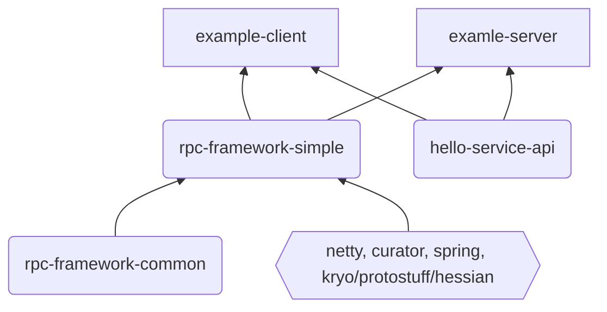

项目地址：[guide-rpc-framework](https://github.com/Snailclimb/guide-rpc-framework)


## 项目结构

- **example-client**: 客户端示例
  - HelloController
  - NettyClient
  - SocketClient
- **examle-server**：服务端示例
  - HelloServiceImpl
  - NettyServer
  - SocketServer
- **hello-service-api**：对外提供的服务接口
  - HelloService
- **rpc-framework-common**：实体对象、枚举、工具
- **rpc-framework-simple**：核心实现




## 服务端

```java
@RpcScan(basePackage = {"github.javaguide"})
public class NettyServerMain {
    public static void main(String[] args) {
        // Register service via annotation
        AnnotationConfigApplicationContext applicationContext = new AnnotationConfigApplicationContext(NettyServerMain.class);
        NettyRpcServer nettyRpcServer = (NettyRpcServer) applicationContext.getBean("nettyRpcServer");
        // Register service manually
        HelloService helloService2 = new HelloServiceImpl2();
        RpcServiceConfig rpcServiceConfig = RpcServiceConfig.builder()
                .group("test2").version("version2").service(helloService2).build();
        nettyRpcServer.registerService(rpcServiceConfig);
        nettyRpcServer.start();
    }
}
```

### 容器加载

1. 在 refresh - invokeBeanFactoryPostProcessors 时，基于 Import-Registrar 机制注入 basePackage 下 `@Component` 和 `@RpcService` 注解的所有 Bean（仅注册，尚未实例化），包括：
   - NettyRpcServer
   - 自定义的 SpringBeanPostProcessor
   - HelloServiceImpl


2. 在 refresh - registerBeanPostProcessors 时，利用 SpringBeanPostProcessor 加载 ExtensionLoader，从 META-INF 目录下读取配置，缓存 SPI 机制支持的实现类：
   - ServiceRegistry - ZkServiceRegistry 服务注册
   - ServiceDiscovery - ZkServiceDiscovery 服务发现
   - LoadBalance - ConsistentHashLoadBalance 负载均衡器
   - RpcRequestTransport - Netty/Socket 客户端类型
   - Serializer - Hessian/Kryo/Protostuff 序列化器
   - Compress - GzipCompress 压缩类型


3. 在 refresh - finishBeanFactoryInitialization - preInstantiateSingletons：
   - `@RpcService`: 创建 zk 持久节点，注册到 ServiceProvider 中
   - ` @RpcReference`: 创建动态代理对象 ClientProxy，替换 Bean 中的被调服务（如 Client 中的 HelloService）


### 注册服务

构建 HelloService2 的 RpcServiceConfig，手动注册第二个 HelloService。NettyRpcServer#registerService 中把该服务注册到 ServiceProvider，具体的：
- serviceProvider::publishService
- 加入服务的本地缓存 serviceMap 中，服务名即 key = serviceName_group_version
- zkServiceRegistry::registerService 创建 zk 持久节点，记录服务名和 ip:port（端口统一是Netty服务端口）


### Netty Server

常规 ServerBootstrap 启动步骤，关键在于添加的处理器链。

```java
public void start() {
    CustomShutdownHook.getCustomShutdownHook().clearAll();
    String host = InetAddress.getLocalHost().getHostAddress();
    EventLoopGroup bossGroup = new NioEventLoopGroup(1);
    EventLoopGroup workerGroup = new NioEventLoopGroup();
    DefaultEventExecutorGroup serviceHandlerGroup = new DefaultEventExecutorGroup(
            RuntimeUtil.cpus() * 2,
            ThreadPoolFactoryUtil.createThreadFactory("service-handler-group", false)
    );
    try {
        ServerBootstrap b = new ServerBootstrap();
        b.group(bossGroup, workerGroup)
                .channel(NioServerSocketChannel.class)
                .childOption(ChannelOption.TCP_NODELAY, true)
                .childOption(ChannelOption.SO_KEEPALIVE, true)
                .option(ChannelOption.SO_BACKLOG, 128)
                .handler(new LoggingHandler(LogLevel.INFO))
                .childHandler(new ChannelInitializer<SocketChannel>() {
                    @Override
                    protected void initChannel(SocketChannel ch) {
                        ChannelPipeline p = ch.pipeline();
                        p.addLast(new IdleStateHandler(30, 0, 0, TimeUnit.SECONDS));
                        p.addLast(new RpcMessageEncoder());
                        p.addLast(new RpcMessageDecoder());
                        p.addLast(serviceHandlerGroup, new NettyRpcServerHandler());
                    }
                });

        ChannelFuture f = b.bind(host, PORT).sync();
        f.channel().closeFuture().sync();
    } catch (InterruptedException e) {
        log.error("occur exception when start server:", e);
    } finally {
        log.error("shutdown bossGroup and workerGroup");
        bossGroup.shutdownGracefully();
        workerGroup.shutdownGracefully();
        serviceHandlerGroup.shutdownGracefully();
    }
}
```

#### IdleStateHandler 

- 处理连接空闲状态


#### RpcMessageEncoder

- 出站处理，负责 RpcMessage -> 协议定义的 ByteBuf


**协议格式**

```
0     1     2     3     4        5     6     7     8         9          10      11     12  13  14   15 16
+-----+-----+-----+-----+--------+----+----+----+------+-----------+-------+----- --+-----+-----+-------+
|   magic   code        |version | full length         | messageType| codec|compress|    RequestId      |
+-----------------------+--------+---------------------+-----------+-----------+-----------+------------+
|                                                                                                       |
|                                         body                                                          |
|                                                                                                       |
|                                        ... ...                                                        |
+-------------------------------------------------------------------------------------------------------+
 
 * 4B  magic code（魔法数）   1B version（版本）   4B full length（消息长度）    1B messageType（消息类型）
 * 1B compress（压缩类型） 1B codec（序列化类型）    4B  requestId（请求的Id）
 * body（object类型数据）
```


#### RpcMessageDecoder

- 入站处理，负责解析协议定义的 ByteBuf -> RpcMessage


#### NettyRpcServerHandler

- 继承自 ChannelInboundHandlerAdapter 的入站处理，主要负责业务逻辑处理
- 根据接收到的消息提取 RpcRequest 交由 RpcRequestHandler 执行业务逻辑
- RpcRequestHandler 根据 RpcRequest 从 ServiceProvider 中找到对应的服务，通过反射执行对应方法
- 执行结果 -> RpcResponse -> RpcMessage  返回出去


## 客户端

```java
@RpcScan(basePackage = {"github.javaguide"})
public class NettyClientMain {
    public static void main(String[] args) throws InterruptedException {
        AnnotationConfigApplicationContext applicationContext = new AnnotationConfigApplicationContext(NettyClientMain.class);
        HelloController helloController = (HelloController) applicationContext.getBean("helloController");
        helloController.test();
    }
}
```

### 容器加载


和 Server 端一样，加载`@Component` 和 `@RpcService` 注解的所有 Bean。区别在于注入了`HelloController`并解析`@RpcReference`注解：
- `@RpcReference`的 version、group 属性决定了 HelloService 接口实际执行时的实现类
- SpringBeanPostProcessor 负责解析`@RpcReference`
  - JDK动态代理接口，封装到继承了 InvocationHandler 的 RpcClientProxy
  - 在 RpcClientProxy#invoke 中构建 RpcRequest，通过 RpcRequestTransport#sendRpcRequest 发送调用请求
  - 拿到服务端响应的 RpcResponse 后返回 (Netty异步，Socket同步)


SpringBeanPostProcessor 实例化时从 ExtensionLoader 获取并缓存了 RpcClient，后续创建 RPC 代理时注入到每个 ClientProxy 代理对象，实际远程调用时通过 RpcClient 发送调用请求并获取结果。


### Netty Client

客户端 Bootstrap 加载了 IdleStateHandler、RpcMessageEncoder、RpcMessageDecoder、NettyRpcClientHandler 四个处理器，和服务端相比有两个区别：
- 封装了 UnprocessedRequests 记录处理中的请求
- NettyRpcClientHandler 中触发空闲事件时会主动发送 heartbeat


## 完整的 RPC 过程


Client 从 HelloService 接口开始，进入代理对象的 invoke 方法，由封装的 RpcClient 构造并发送 RPC 请求，期间需要从 ZK 获取服务节点，并根据负载均衡选择节点，经 Encoder 序列化、压缩后发送 Netty 请求。

Server 接收到请求后，经 Decoder 反序列化、解压后交给 ServerHandler，由 RpcRequestHandler 处理请求，期间需要从 ServiceProvider 获取对应的服务，然后通过反射调用执行对应方法，执行的结果同样经 Encoder 序列化、压缩后通过 Netty 响应给客户端。

Client 接收到响应后，经 Decoder 反序列化、解压后，交给 ClientHandler 取出 data 数据返回出去，最后回到 HelloService 继续执行。至此，一个简化的，完整的 RPC 请求调用过程执行完毕。

