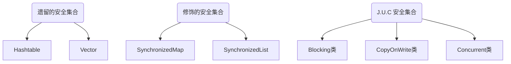

## 基本概念

+ 并发：多个任务交替执行 (微观串行，宏观并行)
+ 并行：多个任务同时执行


- 同步：一旦开始，调用者必须等到方法调用返回后，才能继续后续的行为
- 异步：一旦开始，调用就会立即返回，调用者可以继续后续的操作


- 临界区：存在对共享资源进行多线程读写操作的代码块
- 竞态条件：多个线程在临界区内执行，由于代码的执行序列不同而导致结果无法预测，称为发生了竞态条件 Race Condition


+ 阻塞：一个线程占用了临界区资源，其它线程必须等待，导致线程挂起，就是阻塞
+ 非阻塞：没有一个线程可以防碍其他线程执行，所有线程都会尝试不断前进


多线程的活跃性问题：
- 死锁：多个线程都占有其它线程需要的资源，且都不释放，从而没有一个线程可以同时拿到所有资源，造成所有线程都进入等待
- 饥饿：某一个或多个线程因为种种原因无法获得所需要的资源，导致一直无法执行
- 活锁：多个线程在竞争资源时，都主动释放给其它线程使用，导致资源不断在两个线程间跳动，从而没有一个线程可以同时拿到所有资源


**进程 & 线程**

为了提高OS的工作效率，人们先后提出了批处理OS、进程、线程、协程。

- 进程：应用程序分配资源的单位，也就是正在运行的程序。各个进程之间互不干扰，保存着程序运行的状态
- 线程：一个进程之内可以分为若干个线程，每个线程负责一个单独的子任务，是 CPU 调度的基本单位
- 协程：一种运行在线程之上的用户态模型，也称纤程，在线程的基础上通过时分复用的方式运行多个协程

进程让操作系统的并发性成为了可能，而线程让进程的内部并发成为了可能。**二者的本质区别在于是否单独占用内存地址及其它系统资源：**

1. 进程单独占有一定的内存地址空间，所以进程间存在内存隔离，数据是分开的，数据共享复杂但是同步简单，各个进程之间互不干扰；而线程共享所属进程占有的内存地址空间和资源，数据共享简单，但是同步复杂。
2. 进程单独占有一定的内存地址空间，一个进程出现问题不会影响其他进程，不影响主程序的稳定性，可靠性高；一个线程崩溃可能影响整个程序的稳定性，可靠性较低。
3. 进程单独占有一定的内存地址空间，进程的创建和销毁不仅需要保存寄存器和栈信息，还需要资源的分配回收以及页调度，开销较大；线程只需要保存寄存器和栈信息，开销较小。

总而言之，线程的优势是通信简单、上下文切换开销低。


**上下文切换**

由于某些原因导致 CPU 不再执行当前的线程，转而执行另一个线程的代码，例如：
- 线程的 cpu 时间片用完
- 垃圾回收
- 有更高优先级的线程需要运行
- 线程自己调用了 sleep、yield、wait、join、park、synchronized、lock 等方法

当发送上下文切换时，OS 需要保存当前线程的状态，并恢复另一个线程的状态，JVM 中对应的就是线程私有的程序计数器，以及栈帧等信息，频繁的上下文切换会影响性能。


## 同步基础


### Thread

> 关于 Java 线程：[Thread 源码阅读](./Thread.md)

Java 中创建主要基于 Thread 和 Running，其中直接创建 Thread 方式实际是合并了 Running 对象，通常更推荐使用 Runnable 接口创建线程，因为：

- Java *单继承多实现*的特性使得 Runnable 接口使用起来比 Thread 更灵活
- Runnable 更符合面向对象，将线程对象单独进行封装。
- Runnable 降低了线程对象和线程任务的耦合性


### 线程间通信

- **锁**
    Java 中的锁都是基于对象的，因此也称对象锁。而同步指线程之间按照一定的顺序执行。基本的加锁使用 synchronized 关键字。

- **等待/通知**
    基于 Object::wait(), notify(), notifyAll() 方法实现

- **信号量**
    JDK 提供 Semaphore 类，或者通过 volatile 关键字实现。volatile 保证内存的可见性，一个变量在一个线程里改变，其它线程立即可知。

- **管道**
    基于管道流的通信方式，使用 JDK 提供的 PipedWriter, PipedReader, PipedOutputStream, PipedInputStream 等

- **其它**
    还有等待其它线程完成的 join(), sleep()，本地线程副本变量工具 ThreadLocal 等


### Synchronized

见 [Synchronized 锁机制](./Synchronized.md)


### wait/notify

Object 对象上了提供了几个 API 用于实现等待唤醒机制，相比于简单的 sleep 更加灵活高效。这些方法底层基于 Object 和 Monitor，因此必须配合 Synchronzied 一起使用：

- `obj.wait()` 让拿到 obj 监视器的线程进入 waitSet 等待
- `obj.wait(long n)` 让拿到 obj 监视器的线程到 waitSet 有限等待
- `obj.notify()` 在 obj 关联的 monitor::waitSet 线程集合中挑一个唤醒
- `obj.notifyAll()` 让 obj 关联的 monitor::waitSet 线程集合全部被唤醒


注意：
1. sleep 是 Thread 方法，而 wait 是 Object 的方法
2. wait 需要配合 Synchronized 并且会释放对象锁，而 sleep()不会释放锁资源，仅让出CPU，且不能被唤醒
3. notify 不会立即释放CPU和锁资源，而是等同步代码执行完毕才释放


**原理：**


对 obj 上锁的线程（monitor 的 Owner 线程）发现条件不满足，调用 wait 后会释放 obj 的锁资源，让其它线程竞争，然后进入 monitor 的 waitSet 集合中，转为 WAITING 状态。EntryList 里的 Blocked 线程和 waitSet 里的 WAITING 线程都处于阻塞状态，不会占用 CPU 时间片。

waitSet 中的线程会在新的 Owner 线程调用 notify/notifyAll 时被唤醒，接着进入 EntryList 列表中和 Blocked 线程一起竞争锁资源。


### park/unpark

见 [LockSupport](./LockSupport.md)


## 内存模型

### JMM

Java 线程之间的通信由 Java 内存模型（Java Memory Model，JMM）控制，JMM 是一个抽象模型，定义了主存、工作内存抽象概念，底层对应着 CPU 寄存器、缓存、硬件内存、CPU 指令优化等。


**特点：**

- 线程间通信必须经过主内存
- 线程对共享变量的所有操作必须在自己的本地内存中进行，不能直接操作主内存


### 重排序

由于流水线技术的产生和中断对流水线的影响，人们提出了指令重排，在不改变程序结果的前提下，通过重排序和组合来实现指令级并行，大幅提高 CPU 吞吐量。具体分三种：

- 编译器优化重排
编译器在不改变单线程程序语义的前提下，可以重新安排语句的执行顺序

- 指令并行重排
现代处理器采用了指令级并行技术来将多条指令重叠执行。如果不存在数据依赖性(即后一个执行的语句无需依赖前面执行的语句的结果)，处理器可以改变语句对应的机器指令的执行顺序

- 内存系统重排
由于处理器使用缓存和读写缓存冲区，这使得加载(load)和存储(store)操作看上去可能是在乱序执行，因为三级缓存的存在，导致内存与缓存的数据同步存在时间差

指令重排可以保证串行语义一致，但是没有义务保证多线程间的语义也一致。因此多线程下指令重排可能导致**内存可见性**问题，需要一些规则来限制。


**Happens-Before**

JMM 认为，只要不改变程序的执行结果（单线程程序和正确同步了的多线程程序），编译器和处理器怎么优化都行。JMM 使用 `happens-before` 规则规定了对共享变量的写操作对其它线程的读操作可见，它是可见性与有序性的一套规则总结。包括如下几条：

1. 程序顺序规则：一个线程中的每一个操作，happens-before 于该线程中的任意后续操作。
2. 锁规则：对一个锁的解锁，happens-before 于随后对这个锁的加锁。
3. volatile 规则：对一个 volatile 域的写，happens-before 于任意后续对这个 volatile 域的读。
4. 传递性：如果 A happens-before B，且 B happens-before C，那么 A happens-before C。
5. start 规则：如果线程 A 执行操作 ThreadB.start() 启动线程 B，那么 A 线程的 ThreadB.start() 操作 happens-before 于线程 B 中的任意操作
6. join 规则：如果线程 A 执行操作 ThreadB.join() 并成功返回，那么线程 B 中的任意操作 happens-before 于线程 A 从 ThreadB.join() 操作成功返回
7. interrupt 规则：线程的中断`interrupt()`先于被中断线程的代码
8. finalize 规则：对象构造函数的执行、结束先于`finalize()`


### 三大特性

由于上述的 Java 内存模型、指令重排序，以及各种优化措施，可以引出线程安全的三大特性

1. 原子性：
   - 若干个操作要么全部执行，要么全部不执行
   - 即要保证指令不会受到线程上下文切换的影响 
2. 可见性：
   - 当一个线程修改了共享变量的值，其他线程能够立即看到这个修改
   - 即要保证指令不会受 cpu 缓存的影响 
3. 有序性：
   - 程序的执行顺序与代码的顺序相同
   - 即要保证指令不会受 cpu 指令并行优化的影响


要编写线程安全的代码，其核心在于要对状态访问操作进行管理，特别是对共享的、可变的状态的访问。


### Volatile

Java 语言规定，如果一个字段被声明成 volatile，Java 线程内存模型将基于写屏障 store fence、读屏障 load fence，确保所有线程看到这个变量的值都是一致的，从而保证可见性和有序性（Synchronized 保证了原子性、可见性，以及临界区前后的有序性）。


**可见性原理**

- 一个线程对 volatile 变量进行读操作时，JMM 会把立即该线程对应的本地内存置为无效，从主内存中读取共享变量的值（MESI 缓存一致性协议）
- 一个线程对 volatile 变量进行写操作时，JMM 会立即把该线程对应的本地内存中共享变量的值刷新到主内存


Synchronized 和 volatile 提供的可见性保证基于**内存栅栏 Memory Barrier**指令，它可以刷新缓存，使缓存无效，刷新硬件的写缓存，以及停止执行管道。另一方面，内存栅栏可能会间接影响性能，因为它们将抑制一些编译器优化操作，并且大多数操作不能被重排序。


**有序性原理**

- 基于读屏障，不会将读屏障之后的代码排在读屏障之前
- 基于写屏障，不会将写屏障之前的代码排在写屏障之后


在保证内存可见性上，volatile 有着与锁相同的内存语义，所以可以作为一个轻量级的锁来使用。但由于 volatile 仅仅保证对单个 volatile 变量的读/写具有原子性，不能解决多线程指令交错产生的并发问题，而锁可以保证整个临界区代码的执行具有原子性。所以在功能上 synchronized 锁比 volatile 更强大，而性能上 volatile 更有优势。


### 不可变


如果一个对象是不可变的，那它天生就是线程安全的，因为不存在并发修改的问题。例如 String, DateTimeFormatter 等不可变的类，以及用 final 实现不可变。


**Defensive Copy**

构造新对象时，通过拷贝创建副本对象，来避免共享的手段称为*Defensive Copy 保护性拷贝*。典型的例子是 String 字符串类型。


**Flyweight Pattern**

需要重用数量有限的同一类对象时，通过与其他类似对象共享尽可能多的数据，来最小化内存使用的一种设计模式，称为 *Flyweight Patern 享元模式*。典型的是 Boolean（缓存 TRUE, FALSE）, Integer（缓存 -128-127）, Long（缓存 -128-127）, Character（缓存 0-127） 等包装类型。


**Final**

final 关键字可以保护数据的一致性，对引用变量来说是引用地址的一致性，对基本类型来说就是值的一致性。底层通过写屏障保证 final 变量的可见性。

例如匿名内部类访问局部变量，要求变量必须是 final 的，底层会通过匿名内部类的构造器拷贝传入该变量值，因此必须保证该变量为 final 不可变，才能保证后续运行结果一致。


**无状态**

特殊的不可变，没有任何成员变量的这种无状态类，也是线程安全的。


## 无锁并发


### CAS

Synchronized 是一种悲观锁，认为每次访问共享资源时都会发生冲突，所以必须对每次数据操作加上锁，以保证临界区的程序同一时间只能有一个线程在执行。

而乐观锁总是假设对共享资源的访问没有冲突，线程可以不停地执行，无需加锁也无需等待，真正发生冲突时再处理。**比较并交换 CAS**就是一种典型的基于乐观锁的同步机制，它是一个原子操作，基于 CPU 提供的 CMPXCHG 原子指令实现。其中，有三个值：

- V：要更新的变量 (var)
- E：预期值 (expected)
- N：新值 (new)

执行时，先判断 V 是否等于 E，如果相等，将 V 的值设置为 N；如果不等，说明已经有其它线程更新了 V，则当前线程放弃更新，什么都不做。


但普通的CAS存在一些问题：
1. ABA 问题，可以使用时间戳/版本号解决，如 JDK 提供的 AtomicStampedReference
2. 自旋循环时间过长，可以结合处理器的 pause 指令
3. 只能保证一个共享变量的原子操作，可以使用 AtomicReference 或 锁机制


CAS 无锁的方式对死锁天然免疫，没有锁竞争带来的开销，也没有线程间频繁调度的开销，因此比基于锁的 synchronized 方式拥有更优越的性能，但如果竞争激烈，还是会发生频繁的重试，同样影响效率，而且 CAS 把处理竞争的问题（重试、回退、放弃，当然原子工具类已经帮我们处理好了）留给了调用者。因此 CAS 适合线程数少、竞争不太激烈的场景。


### Unsafe

CAS 是一种实现无锁的思想，CPU 层面提供了实现可能。在 Java 层面，JDK 提供了 Unsafe 类用于实现多样的 CAS 操作，具体见[Unsafe 源码阅读](./Unsafe.md)。


### 原子工具

在**Unsafe类**和**CAS 思想**的基础之上，JDK 提供了更多方便易用的无锁并发工具类。


1. 原子整数
   - AtomicBoolean
   - AtomicInteger
   - AtomicLong

2. 原子引用
   - AtomicReference
   - AtomicStampedReference (维护版本号，解决了 ABA 问题)
   - AtomicMarkableReference (简化带版本号的 CAS，只关注是否修改过)

3. 原子数组
   - AtomicIntegerArray
   - AtomicLongArray
   - AtomicReferenceArray

4. 原子域更新器（针对对象的 volatile 域）
   - AtomicIntegerFieldUpdater
   - AtomicLongFieldUpdater
   - AtomicReferenceFieldUpdater

5. 原子累加器（基于分治思想，类似 fork/join，分 cell 累加最后汇总）
   - DoubleAdder (仅相加)
   - DoubleAccumulator (自定义累加规则)
   - LongAdder (仅相加)
   - LongAccumulator (自定义累加规则)


## JDK 并发工具


### 线程池

见 [ThreadPoolExecutor 源码分析](./ThreadPoolExecutor.md)


### ForkJoin

Fork/Join 是 JDK 1.7 新加入的线程池实现，基于分治思想，把每个任务的分解和合并交给不同的线程来完成，以最大化利用多核处理器提高应用程序的性能，适用于能够进行任务拆分的 CPU 密集型运算。


Fork/Join框架会将任务分配给线程池中的线程，执行任务时会使用工作窃取算法：


```java
// 任务类需要继承：有返回值的 RecursiveTask / 无返回值的 RecursiveAction
class AddTask extends RecursiveTask<Integer> {
    int n;
    public AddTask(int n) {
        this.n = n;
    }

    // 重写 compute
    @Override
    protected Integer compute() {
        if (n == 1) {
            log.debug("join() {}", n);
            return n;
        }
        
        // 拆分任务：fork() 使用线程池中的空闲线程异步提交任务
        AddTask t = new AddTask(n - 1);
        t1.fork();
        log.debug("fork() {} + {}", n, t1);
        
        // 合并结果：join() 等待处理任务的线程执行完毕，获得返回值
        int result = n + t1.join();
        log.debug("join() {} + {} = {}", n, t1, result);
        return result;
    }
}

// 创建并行度 4 的 ForkJoin 线程池
ForkJoinPool pool = new ForkJoinPool(4);
// 提交可分解的任务
System.out.println(pool.invoke(new AddTask(5)));
```


Java 8 开始的 Stream 接口默认是使用串行的方式，通过 parallel() 可以使计算并行化，一个 Java 进程的 Stream 并行计算任务共享一个线程池。其底层就是使用了 ForkJoin 框架，根据是否是 parallel 创建流对应的任务`ReduceTask -> AbstractTask -> CountedCompleter -> ForkJoinTask`，执行时间接调用了ForkJoinTask::invoke()。

- stream.parallel()
- list.parallelStream()
- Arrays.parallelSort(arr)
- Arrays.parallelSetAll(arr, generator)
- ......


### ThreadLocal

见：[Java - ThreadLocal](./java-threadlocal.md)


### AQS

AQS 是众多 JDK 并发工具的底层基础，代码非常精妙，具体见 [AQS 源码解析](./AQS.md)


### ReentrantLock

可重入锁 ReentrantLock 是 Lock 锁接口的默认实现，内部基于 **AQS->Sync->NonfairSync/FairSync** 两个同步器，都是独占式的排它锁。相比于原始的 Synchronized 锁机制，ReentrackLock 的特点包括：

- 可中断
- 支持超时时间 
- 支持公平/非公平
- 支持多条件变量


**核心 API**

```java
// 创建基于 NonfairSync 的非公平锁
ReentrantLock lock = new ReentrantLock();
// 创建基于 FairSync 的公平锁
ReentrantLock lock = new ReentrantLock(true);

// 加锁，如果锁已经被占用则等待（默认不可中断，永久阻塞）
lock.lock();
// 解锁
lock.unlock();

// 加可中断锁
// 没有竞争直接获得锁，有竞争则进入阻塞队列，但可以被 interrupt 中断
lock.lockInterruptibly();

// 尝试加锁，失败会立刻返回
lock.tryLock();
// 支持超时设置
lock.tryLock(time, TimeUnit);

// 创建重入锁关联的条件变量
Condition cond = lock.newCondition();
// 当前线程（已上锁）释放锁，进入 conditionObject 等待
cond.await();
// 等待，但不响应中断
cond.awaitUninterruptibly();
// 随机唤醒该条件变量上等待的线程
cond.signal();
// 唤醒该条件变量上等待的所有线程
cond.signalAll();
```


### ReentrantReadWriteLock

ReentrantReadWriteLock 是 JDK 5 提供的`ReadWriteLock`读写锁接口的默认实现，底层同样是基于 **AQS->Sync->NonfairSync/FairSync** 两个同步器。当读操作远远高于写操作时，可以让`读-读`并发，有效减少锁竞争，提升系统性能，并且支持可重入、公平/非公平。

**核心 API**

```java
// 默认基于 NonfairSync 的非公平锁
ReentrantReadWriteLock rw = new ReentrantReadWriteLock();
// 基于 FairSync 的公平锁
ReentrantReadWriteLock rw = new ReentrantReadWriteLock(true);

// 获取读锁
ReentrantReadWriteLock.ReadLock r = rw.readLock();
// 获取写锁
ReentrantReadWriteLock.WriteLock w = rw.writeLock();

// 上锁
r.lock();
// 解锁
r.unlock();
```


### StampedLock

StampedLock 是 Java 8 引入的一个新的同步工具，性能十分优异，可以取代ReentrantReadWriteLock。它提供了乐观读、悲观读和写锁的语义，特点是在使用读锁、写锁时都必须配合**Stamp 戳**使用加解读锁，以支持更细粒度的锁定。底层基于 CAS 操作和锁状态的原子操作，并借鉴了 AQS 的实现。

**核心 API**

```java
StampedLock stampedLock = new StampedLock();

long stamp = stampedLock.readLock();            // 乐观读锁 
long stamp = stampedLock.tryOptimisticRead();   // 尝试乐观读锁  
stampedLock.unlockRead(stamp);                  // 释放乐观读锁

long stamp = stampedLock.writeLock();   // 获取写锁
stampedLock.unlockWrite(stamp);         // 释放写锁

stampedLock.validate(stamp)             // 检查是否有其他线程修改了数据 
```


### Semaphore

Semaphore 信号量是一种基于 AQS 实现的同步工具，用于控制对共享资源的访问，它是锁机制的扩展，允许多个线程同时访问共享资源。实现上，它使用一个计数器来跟踪可用的资源数量，当一个线程需要访问资源时，它首先尝试获取一个许可证，如果计数器为零，则该线程将被阻塞，直到其他线程释放一个许可证。

**核心 API**

```java
// 创建一个初始许可证数量为 5 的Semaphore，默认非公平
Semaphore semaphore = new Semaphore(5);

// 获取许可证
semaphore.acquire();
semaphore.tryAcquire(timeout, TimeUnit);
semaphore.acquireUninterruptibly()

// 释放许可证
semaphore.release();
```


### CountdownLatch

CountdownLatch 倒计数器（Latch：门闩）。同样是基于 AQS 实现的同步器，用于在并行计算中同步线程，使一个或多个线程等待其他线程完成操作。

**核心 API**

```java
// // 创建一个初始计数为 3 的 CountDownLatch
CountDownLatch latch = new CountDownLatch(3);

// 减少计数（其它线程）
latch.countDown();  

// 等待计数归零（等待线程）
latch.await();  
```


### CyclicBarrier

CyclicBarrier 循环栅栏，允许一组线程互相等待，直到所有线程都达到某个状态后再一起继续执行，并且计数器可以复用（类似人满发车的概念）。底层基于 ReentrantLock 和 Condition 实现等待/通知模式。

**核心 API**

```java
// 创建一个初始线程数为 3 的 CyclicBarrier，以及对应的回调任务
CyclicBarrier cyclicBarrier = new CyclicBarrier(3, () -> {...});

try {
    // 设置 Barrier，阻止线程继续执行，直到指定数量的线程执行完成
    cyclicBarrier.await();
} catch (InterruptedException | BrokenBarrierException e) {
    // BrokenBarrierException 表示当前 Barrier 已经破损，可能无法等待所有线程到齐
    // 例如一个线程被中断，其它线程就会收到该异常
    e.printStackTrace();
}
```


### 线程安全集合

线程安全的集合可以分为三大类：



1. **遗留的同步安全集合**
  
    如 Hashtable, Vetor，内部直接使用加锁方式保证线程安全，性能差，不推荐使用

1. **Collections 装饰的安全集合**
   
   通过装饰模式，将非线程安全的集合封闭起来，并暴露加锁的对外方法，来构造线程安全的集合。
   - Collections.synchronizedCollection
   - Collections.synchronizedList 
   - Collections.synchronizedMap 
   - Collections.synchronizedSet 
   - Collections.synchronizedNavigableMap 
   - Collections.synchronizedNavigableSet
   - Collections.synchronizedSortedMap 
   - Collections.synchronizedSortedSet  

2. **JUC 下的并发安全集合**
   - Blocking：
     - 阻塞式集合，大部分基于锁实现
     - 队列已满时，put 将阻塞直到有空间可用；队列为空时，take 将阻塞直到有元素可用
   - CopyOnWrite：
     - 写时复制容器，即添加元素时先 copy 当前容器并添加元素，再替换原来的引用，实现不需要加锁的并发读
     - 修改的开销相对较重，适用于迭代操作远多于修改的场景
   - Concurrent：
     - 大量使用 CAS 优化，可以提供很高的吞吐量
     - 遍历/计算容量/读取时弱一致性（相比于非安全的容器，并发修改会 fail-fast 抛出ConcurrentModifificationException）


### 异步编排

Java 8 新增，继承自 CompletionStage 接口，实现了 50 多种方法，用于函数式异步编程的流式调用，支持回调处理执行结果，并且提供了转换和组合 CompletableFuture 的方法。

**创建**

```java
// 没有指定 Executor 则使用 ForkJoinPool.commonPool() 作为默认线程池
// runAsync 不支持返回值，supply 支持返回值
static CompletableFuture<Void> runAsync(Runnable runnable)
public static CompletableFuture<Void> runAsync(Runnable runnable, Executor executor)
public static <U> CompletableFuture<U> supplyAsync(Supplier<U> supplier)
public static <U> CompletableFuture<U> supplyAsync(Supplier<U> supplier, Executor executor)
```

**处理结果**
```java
// Async 方式是将任务提交线程池执行，否则在当前线程执行
public CompletableFuture<T> whenComplete(BiConsumer<? super T,? super Throwable> action);
public CompletableFuture<T> whenCompleteAsync(BiConsumer<? super T,? super Throwable> action);
public CompletableFuture<T> whenCompleteAsync(BiConsumer<? super T,? super Throwable> action, Executor executor);
public CompletableFuture<T> exceptionally(Function<Throwable,? extends T> fn);

public <U> CompletionStage<U> handle(BiFunction<? super T, Throwable, ? extends U> fn);
public <U> CompletionStage<U> handleAsync(BiFunction<? super T, Throwable, ? extends U> fn);
public <U> CompletionStage<U> handleAsync(BiFunction<? super T, Throwable, ? extends U> fn,Executor executor);
```

**线程串行化**
```java
public <U> CompletableFuture<U> thenApply(Function<? super T,? extends U> fn)
public <U> CompletableFuture<U> thenApplyAsync(Function<? super T,? extends U> fn)
public <U> CompletableFuture<U> thenApplyAsync(Function<? super T,? extends U> fn, Executor executor)

public CompletionStage<Void> thenAccept(Consumer<? super T> action);
public CompletionStage<Void> thenAcceptAsync(Consumer<? super T> action);
public CompletionStage<Void> thenAcceptAsync(Consumer<? super T> action,Executor executor);

public CompletionStage<Void> thenRun(Runnable action);
public CompletionStage<Void> thenRunAsync(Runnable action);
public CompletionStage<Void> thenRunAsync(Runnable action,Executor executor);
```


> 只有当大量相互独立且同构的任务可以并发进行处理时，才能体现出任务并行化带来的性能提升。


