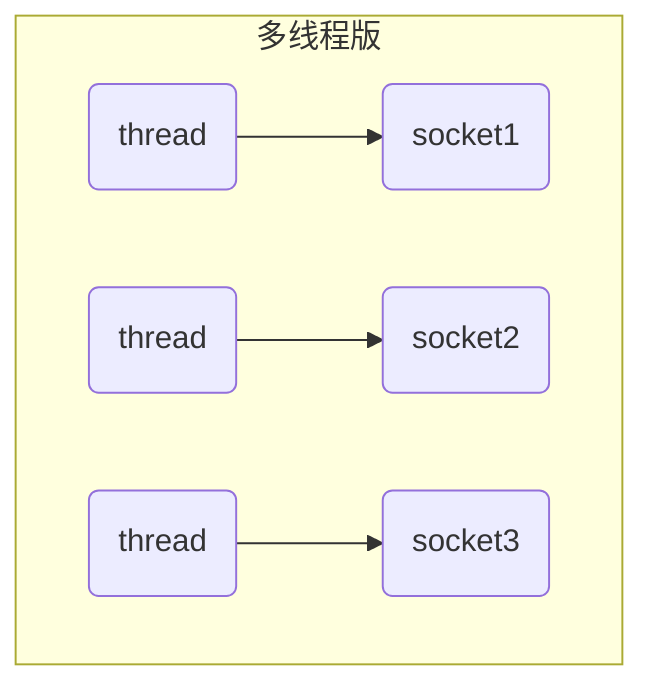
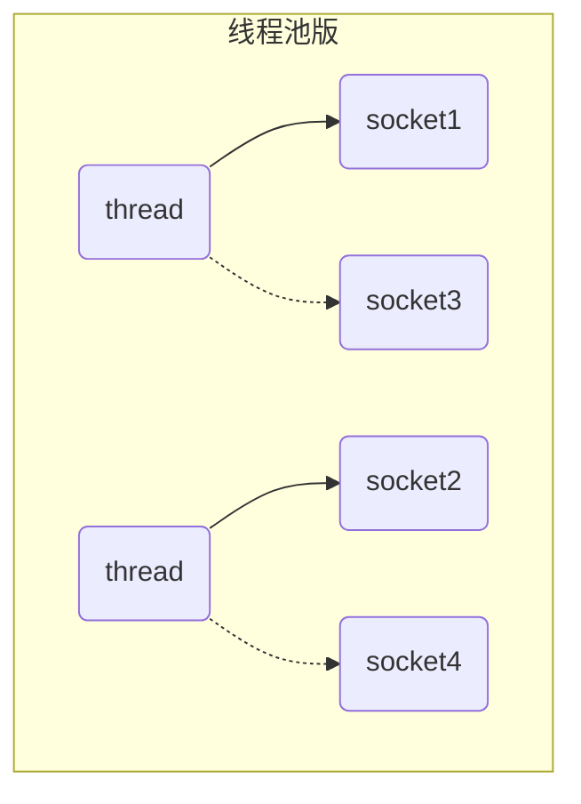
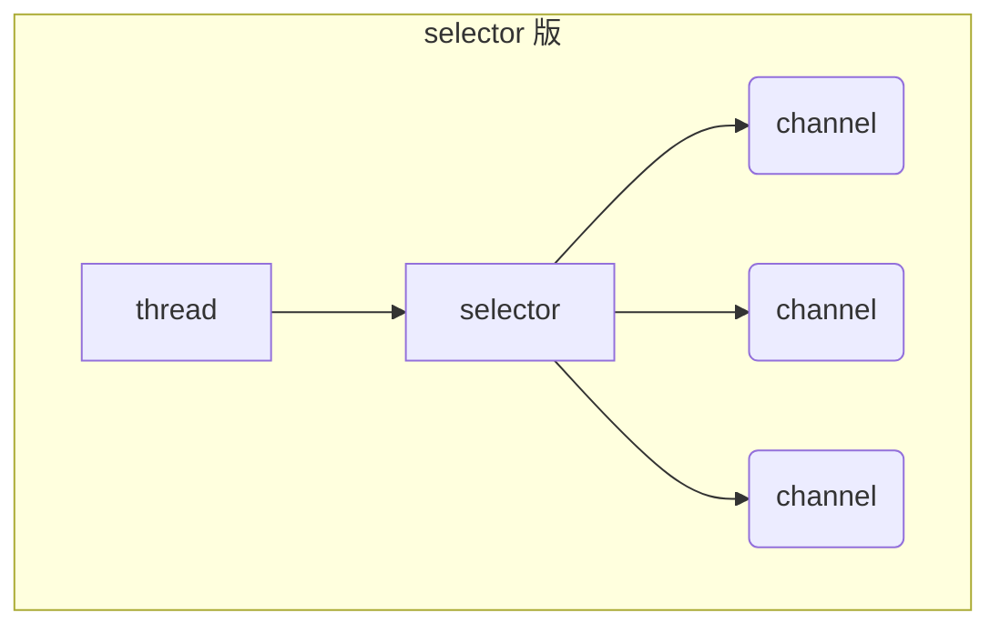

## 三大组件

### Channel

channel 类似 BIO 的 stream，可以作为数据源，是读写数据的**双向通道**。


常见的 Channel：
* FileChannel
* DatagramChannel
* SocketChannel
* ServerSocketChannel


**stream vs channel**

* stream 要么是输入流，要么是输出流。而 channel 是双向的，可以从 channel 将数据读入 buffer，也可以将 buffer 数据写入 channel 
* stream 不会自动缓冲数据，而 channel 会利用系统提供的发送缓冲区和接收缓冲区，更为底层
* stream 仅支持阻塞 API，而 channel 同时支持阻塞、非阻塞 API，并且网络 channel 可配合 selector 实现多路复用
* 二者均为全双工，即读写可以同时进行（与单向/双向通道不冲突）


### Buffer

buffer 用于缓冲读写数据，常见的 buffer 有：

* ByteBuffer
  * MappedByteBuffer
  * DirectByteBuffer
  * HeapByteBuffer
* ShortBuffer
* IntBuffer
* LongBuffer
* FloatBuffer
* DoubleBuffer
* CharBuffer


### Selector

了解 Selector 之前，得先知道服务器设计的演化，才能了解它解决了什么问题，起到什么作用。

#### 多线程

在传统的多线程版服务器设计中，对于每个客户端的 socket 请求，服务端都要新开一个线程去处理。因此存在如下的缺点：
* 内存占用高
* 线程上下文切换成本高
* 只适合连接数少的场景



#### 线程池

基于线程池的服务器设计中，服务端复用线程池里的线程处理请求，但在阻塞模式下，一个线程仅能处理一个 socket 连接，因此仅适合短连接场景。




#### 多路复用

NIO 的 selector 可以配合一个线程来管理多个 channel，select() 方法会阻塞直到获取这些 channel 上发生的读写就绪事件，交给单独的处理器线程。这些 channel 工作在非阻塞模式下，不会让线程吊死在一个 channel 上。适合**连接多、流量低**的场景。




## ByteBuffer


### 使用姿势

1. 向 buffer 写入数据，例如调用 channel.read(buffer)
2. 调用 flip() 切换至**读模式**
3. 从 buffer 读取数据，例如调用 buffer.get()
4. 调用 clear() 或 compact() 切换至**写模式**
5. 重复 1~4 步骤

```java
try (FileChannel channel = new FileInputStream(new File("data.txt")).getChannel()) {
    ByteBuffer buffer = ByteBuffer.allocate(10);
    while (true) {
        int len = channel.read(buffer);
        log.debug("读取到的字节数 {}", len);
        if (len == -1) {
            break;
        }
        // 切换至读模式
        buffer.flip();
        while (buffer.hasRemaining()) {
            byte b = buffer.get();
            log.debug("实际字节 {}", (char) b);
        }
        // 重置，切换为写模式
        buffer.clear();
    }
} catch (IOException e) {
    e.printStackTrace();
}
```


### 数据结构

ByteBuffer 是平时最常使用的 Buffer 实现，有三个重要属性：
* capacity
* position
* limit

**初始状态**


**写模式下**，position 是写入位置，limit 等于容量，下图表示写入了 4 个字节后的状态


**执行 flip()** 后，position 切换为读取位置，limit 切换为读取限制


读取 4 个字节后，position 指向下一个读取的索引，状态如下：


**执行 clear()** 会重置 bytebuffer，清除缓冲区标记


**执行 compact()** 会把未读完的部分向前压缩，然后切换至写模式


⚠️另外需要注意：
- Buffer 是**非线程安全的**
- Buffer 是**无边界的**数据缓冲区，需要自己解决粘包、半包问题 (长度信息、特定分隔符)


### API

#### 分配空间

可以使用 allocate 方法为 ByteBuffer 分配空间，其它 buffer 类也有该方法。

```java
// heap bytebuffer
ByteBuffer byteBuffer = ByteBuffer.allocate(16);
// direct bytebuffer
ByteBuffer directByteBuffer = ByteBuffer.allocateDirect(16);
```

- HeapByteBuffer: 堆内存，读写效率较低，受到 GC 的影响
- DirectByteBuffer: 直接内存，读写效率高（少一次拷贝），不会受 GC 影响，分配的效率低


#### 写入数据

```java
// 1.调用 channel 的 read 方法
int len = channel.read(buf);

// 2.调用 buffer 自己的 put 方法
buf.put((byte)127);

// 3.集中写
ByteBuffer b1 = StandardCharsets.UTF_8.encode("hello");
ByteBuffer b2 = StandardCharsets.UTF_8.encode("world");
ByteBuffer b3 = StandardCharsets.UTF_8.encode("你好");
channel.write(new ByteBuffer[]{b1, b2, b3});
```


#### 读取数据

```java
// 1.调用 channel 的 write 方法
int len = channel.write(buf);

// 2.调用 buffer 自己的 get 方法
byte b = buf.get();

// 3.分散读
ByteBuffer a = ByteBuffer.allocate(3);
ByteBuffer b = ByteBuffer.allocate(3);
ByteBuffer c = ByteBuffer.allocate(5);
channel.read(new ByteBuffer[]{a, b, c});
```

get 方法会让 position 读指针向后走，如果想重复读取数据
* 可以调用 rewind 方法将 position 重新置为 0
* 或者调用 get(index) 方法获取指定索引的内容，并且不会移动读指针


#### 指定索引

mark() 可以在当前索引打上一个标记，只要调用 reset()，position 就能回到 mark 标记的位置。

```java
ByteBuffer buffer = ByteBuffer.allocate(10);
buffer.put(new byte[]{'a', 'b', 'c', 'd'});
buffer.flip();

System.out.println((char) buffer.get());    // a
System.out.println((char) buffer.get());    // b

// 加标记，索引2 的位置
buffer.mark(); 
System.out.println((char) buffer.get());    // c
System.out.println((char) buffer.get());    // d

// 将 position 重置到索引 2
buffer.reset(); 
System.out.println((char) buffer.get());    // c
System.out.println((char) buffer.get());    // d
```

⚠️注：rewind() 和 flip() 都会清除 mark 标记


#### 字符串互转

```java
// 1.1. 字符串 -> ByteBuffer
ByteBuffer buffer1 = ByteBuffer.allocate(16);
buffer1.put("hello".getBytes());

// 1.2. Charset
ByteBuffer buffer2 = StandardCharsets.UTF_8.encode("hello");
ByteBuffer buffer3 = Charset.forName("utf-8").encode("你好");

// 1.3. wrap
ByteBuffer buffer4 = ByteBuffer.wrap("hello".getBytes());


// 2. ByteBuffer -> 转为字符串
buffer1.flip();
String str1 = StandardCharsets.UTF_8.decode(buffer1).toString();
String str2 = StandardCharsets.UTF_8.decode(buffer2).toString();
```


## 文件编程

FileChannel 是用于操作文件的 Channel，只能工作在阻塞模式下，通过代码操作文件要谨慎。不过并不常用，了解即可。


### 获取通道

FileChannel 不能直接打开，必须通过 FileInputStream / FileOutputStream / RandomAccessFile 来获取，它们都有 getChannel 方法：

* FileInputStream 获取的 channel 只能读
* FileOutputStream 获取的 channel 只能写
* RandomAccessFile 获取的 channel 能否读写由 RandomAccessFile 的读写模式决定


### API

```java
// 读取：channel -> ByteBuffer，返回读取字节数
int readBytes = channel.read(buffer);


// 写入：ByteBuffer -> channel
// write 方法并不能保证一次将 buffer 中的内容全部写入 channel
while(buffer.hasRemaining()) {
    channel.write(buffer);
}


// 获取/设置 position
// 读取文件末尾返回 -1；写入文件末尾即追加
long pos = channel.position();
channel.position(newPos);


// 大小
long size = channel.size();


// 立即刷盘，参数表示是否刷盘元数据
channel.force(true);


// 关闭
// FileInputStream/FileOutputStream/RandomAccessFile 的 close 方法会间接地调用 channel 的 close 方法
channle.close();


// 传输数据
// 底层使用零拷贝，效率非常高
FileChannel from = new FileInputStream("from.txt").getChannel();
FileChannel to = new FileOutputStream("to.txt").getChannel()
from.transferTo(0, from.size(), to);
```


### Path

jdk7 引入 Path 用来表示文件路径，以及工具类 Paths 来获取 Path 实例


```java
// 相对路径，使用 user.dir 环境变量来定位 1.txt
Path source = Paths.get("1.txt");

// 绝对路径
Path source = Paths.get("d:\\1.txt");
Path source = Paths.get("d:/1.txt");

// 自动拼接，表示 d:\data\projects
Path projects = Paths.get("d:\\data", "projects");

// normalize 标准化路径
Path path = Paths.get("d:\\data\\projects\\a\\..\\b");
System.out.println(path.normalize()); // 输出 d:\data\projects\b
```


### Files

用于文件的工具类，提供了许多文件/目录相关的API：

```java
// 判断文件是否存在
System.out.println(Files.exists(path));


// 创建单级目录，已存在则抛出异常
Files.createDirectory(path);
// 创建多级目录，已存在也不抛异常
Files.createDirectories(path);


// 拷贝文件
Files.copy(source, target, StandardCopyOption.REPLACE_EXISTING);
// 移动文件
Files.move(source, target, StandardCopyOption.ATOMIC_MOVE);
// 删除文件/空目录
Files.delete(target);
```


遍历文件提供了两种方式:

```java
// walk 返回一个文件流
Files.walk(path, maxDepth, options).forEach(path -> {...});

// walkFileTree 配合 FileVisitor 提供更加灵活的处理访问
Files.walkFileTree(Paths.get("C:\\Users\\chanper\\Downloads"), new SimpleFileVisitor<Path>() {
    @Override
    public FileVisitResult visitFile(Path file, BasicFileAttributes attrs) throws IOException {
        System.out.println(file.getFileName());
        return super.visitFile(file, attrs);
    }
    @Override
    public FileVisitResult postVisitDirectory(Path dir, IOException exc) throws IOException {
        System.out.println(dir.getFileName());
        return super.postVisitDirectory(dir, exc);
    }
});
```


## 网络编程


### 阻塞 vs 非阻塞

#### 阻塞

阻塞模式下，相关方法会暂停线程，期间不占用 CPU。例如：
* ServerSocketChannel.accept 没有连接建立时会暂停线程
* SocketChannel.read 没有数据可读时会暂停线程


**服务端**

```java
// 0. ByteBuffer
ByteBuffer buffer = ByteBuffer.allocate(16);

// 1. 创建服务器
ServerSocketChannel ssc = ServerSocketChannel.open();

// 2. 绑定监听端口
ssc.bind(new InetSocketAddress(8080));

// 3. 连接集合
List<SocketChannel> channels = new ArrayList<>();

while (true) {
    // 4. 建立与客户端连接，SocketChannel 用来与客户端通信
    SocketChannel sc = ssc.accept();
    channels.add(sc);

    // 5. 接收客户端发送的数据
    for (SocketChannel channel : channels) {
        channel.read(buffer);
        buffer.flip();
        debugRead(buffer);
        buffer.clear();
    }
}
```

**客户端**

```java
SocketChannel sc = SocketChannel.open();
sc.connect(new InetSocketAddress("localhost", 8080));
System.out.println("waiting...");
```


**存在的问题**

* 单线程下，阻塞方法之间相互影响，几乎不能正常工作，需要多线程支持
* 多线程下，又会有新的问题
  * 32 位 JVM 一个线程 320k，64 位 JVM 一个线程 1024k，如果连接数过多可能导致 OOM，频繁上下文切换也会导致性能降低
  * 可以采用线程池技术来减少线程数和线程上下文切换，但治标不治本，如果有很多连接建立，但长时间 inactive，会阻塞线程池中所有线程，因此不适合长连接，只适合短连接


#### 非阻塞

非阻塞模式下，相关方法不会让线程暂停，例如：
* ServerSocketChannel.accept 没有连接建立时，返回 null 继续运行
* SocketChannel.read 没有数据可读时，返回 0 继续运行
* 写数据时，线程只需等待数据写入 Channel，无需等待 Channel 通过网络把数据实际发送出去


**服务端开启非阻塞模式**

```java
// 0. ByteBuffer
ByteBuffer buffer = ByteBuffer.allocate(16);

// 1. 创建服务器，并开启非阻塞
ServerSocketChannel ssc = ServerSocketChannel.open();
ssc.configureBlocking(false);

// 2. 绑定监听端口
ssc.bind(new InetSocketAddress(8080));

// 3. 连接集合
List<SocketChannel> channels = new ArrayList<>();
while (true) {
    // 4. 建立与客户端连接
    SocketChannel sc = ssc.accept();
    if (sc != null) {
        // SocketChannel 开启非阻塞模式
        sc.configureBlocking(false);
        channels.add(sc);
    }

    // 5. 接收客户端发送的数据
    for (SocketChannel channel : channels) {
        int read = channel.read(buffer);
        if (read > 0) {
            buffer.flip();
            debugRead(buffer);
            buffer.clear();
        }
    }
}
```

**存在的问题**

非阻塞模式下，即使没有连接建立和可读数据，线程仍然在不断运行，浪费了 CPU 资源。另外在数据的拷贝过程中，线程实际还是阻塞的（正是 AIO 改进的地方）。


### Selector


单线程下可以使用 Selector 完成对多个 Channel 读写事件的监控，称为多路复用技术：
* 有事件发生时线程才去处理，避免非阻塞模式下做无用功
* 让线程得到充分利用
* 节约线程数量，减少上下文切换的开销
* 仅针对网络 IO，不适用于普通文件 IO


::: tip 底层实现
Java NIO 会根据操作系统、JDK 版本、运行环境选择合适的底层实现，通常倾向于使用更高性能的 epoll 模型，以提供更好的性能和并发处理能力。
:::


#### API

**创建**

```java
Selector selector = Selector.open();
```

**注册事件**

将通道注册到选择器，并指定感兴趣的事件

```java
channel.configureBlocking(false);
SelectionKey key = channel.register(selector, SelectionKey.OP_XXX);
```

* Channel 必须工作在非阻塞模式
* FileChannel 没有非阻塞模式，因此不能配合 Selector 使用
* 绑定的事件类型有四个，本质上是整数：
  * connect 客户端连接就绪时触发
  * accept 服务器端成功接受连接时触发
  * read 通道可读时触发
  * write 通道可写时触发


**监听事件**

三种方法监听是否有事件发生，返回值代表有多少 channel 发生了事件：

```java
// 方法1：阻塞直到有关注的事件发生
int count = selector.select();

// 方法2：阻塞直到有关注的事件发生，或是超时（单位ms）
int count = selector.select(long timeout);

// 方法3，不会阻塞，立刻返回
int count = selector.selectNow();
```

::: tip select()不阻塞的情况

1. 有事件发生时：
   * 客户端发起连接请求，触发 accept 事件
   * 客户端发送数据/正常关闭/异常关闭，触发 read 事件（大于缓冲区会触发多次）
   * 通道可写，触发 write 事件
   * linux 下发生 nio bug 时
2. 调用 selector.wakeup()
3. 调用 selector.close()
4. selector 所在线程被中断

:::


#### 处理事件

**服务端模板**

```java
// 1.创建 Selector, ServerSocketChannel
Selector selector = Selector.open();
ServerSocketChannel ssc = ServerSocketChannel.open();
ssc.configureBlocking(false);

// 2.关联 selector、ssc，并注册感兴趣事件
SelectionKey sscKey = ssc.register(selector, SelectionKey.OP_ACCEPT, null);
ssc.bind(new InetSocketAddress(8080));

while (true) {
    // 3.select阻塞方法，返回发生了且未处理的事件
    selector.select();
    
    // 4.处理事件
    Iterator<SelectionKey> iter = selector.selectedKeys().iterator();
    while (iter.hasNext()) {
        SelectionKey key = iter.next();
        
        // 5.根据事件类型做处理
        if (key.isAcceptable()) {
            ...            
        } else if(key.isReadable()) {
            ...
        } else if(key.isWritable()) {
            ...
        }

        iter.remove();
    }
}
```

- SelectionKey 封装了发生的事件类型，以及对应的 channel 用于和客户端进行通信
    ```java
    selectionKey.isAcceptable();
    selectionKey.isConnectable();
    selectionKey.isReadable();
    selectionKey.isWritable();

    SocketChannel channel = (SocketChannel) selectionKey.channel();
    ```
- 由于 NIO 底层使用水平触发，因此监测到事件后必须处理/取消，否则后续仍然会触发
    ```java
    // 取消注册在 selector 上的 channel，并将 key 加入 cancelledKeys 集合等待删除
    selectionKey.cancel()
    ```
- Selector 会向 selectedKeys 集合里新增待处理的元素，但不会主动移除，因此要手动移除处理完毕的 SelectionKey


##### 处理 accept

```java
if (key.isAcceptable()) {
    // 此 ssc 即服务端一开始 open 的 ServerSocketChannel（门卫）
    ServerSocketChannel ssc = (ServerSocketChannel) key.channel();
    // 此 sc 为专用于和某个客户端通信的 SocketChannel
    SocketChannel sc = ssc.accept();

    // 将此 SocketChannel 注册到 selector，并注册后续关注的事件
    sc.register(selector, SelectionKey.OP_READ | SelectionKey.OP_WRITE, null);
}
```


##### 处理 read

麻烦的地方在于处理数据的边界，即粘包半包问题，常用的方案有：
- 固定长度消息，缺点是浪费带宽
- 指定分隔符，缺点是效率低
- TLV（Type-Length-Value），缺点是 buffer 需要提前分配，如果内容过大，会影响 server 吞吐量

```java
...

ByteBuffer byteBuffer = ByteBuffer.allocate(128);
// 添加 attachment
SelectionKey scKey = sc.register(selector, SelectionKey.OP_READ, byteBuffer);

...                 
if (key.isAcceptable()) {
    SocketChannel sc = ssc.accept();
    sc.configureBlocking(false);
    
    ByteBuffer byteBuffer = ByteBuffer.allocate(7);
    // 把要写入的 ByteBuffer 作为附件加入 selectionKey
    SelectionKey scKey = sc.register(selector, SelectionKey.OP_READ, byteBuffer);      
} else if (key.isReadable()) {
    try {
        // 此 SocketChannel 即 ssc 接受连接后注册到 selector 的 sc
        SocketChannel channel = (SocketChannel) key.channel();
        // 获取 selectionKey 上关联的附件
        ByteBuffer buffer = (ByteBuffer) key.attachment();
        int read = channel.read(buffer);
        if(read == -1) {
            key.cancel();
        } else {
            split(buffer);
            // 需要扩容
            if (buffer.position() == buffer.limit()) {
                ByteBuffer newBuffer = ByteBuffer.allocate(buffer.capacity() * 2);
                buffer.flip();
                newBuffer.put(buffer); // 0123456789abcdef3333\n
                key.attach(newBuffer);
            }
        }
    } catch (IOException e) {
        e.printStackTrace();
        key.cancel();  // 因为客户端断开了,因此需要将 key 取消（从 selector 的 keys 集合中真正删除 key）
    }
}

...


private static void split(ByteBuffer source) {
    source.flip();
    for (int i = 0; i < source.limit(); i++) {
        // 找到一条完整消息
        if (source.get(i) == '\n') {
            int length = i + 1 - source.position();
            ByteBuffer target = ByteBuffer.allocate(length);
            for (int j = 0; j < length; j++)
                target.put(source.get());
            debugAll(target);
        }
    }
    source.compact();
}
```


::: tip ByteBuffer 大小分配

* 每个 channel 都需要记录可能被切分的消息，因为 ByteBuffer 不能被多个 channel 共同使用，因此需要为每个 channel 维护一个独立的 ByteBuffer
* ByteBuffer 不能太大，比如一个 ByteBuffer 1Mb 的话，要支持百万连接就要 1Tb 内存，因此需要设计大小可变的 ByteBuffer
  * 一种思路是首先分配一个较小的 buffer，例如 4k，如果发现数据不够，再分配 8k 的 buffer，将 4k buffer 内容拷贝至 8k buffer，优点是消息连续容易处理，缺点是数据拷贝耗费性能，参考实现 [http://tutorials.jenkov.com/java-performance/resizable-array.html](http://tutorials.jenkov.com/java-performance/resizable-array.html)
  * 另一种思路是用多个数组组成 buffer，一个数组不够，把多出来的内容写入新的数组，与前面的区别是消息存储不连续解析复杂，优点是避免了拷贝引起的性能损耗

实际上，Netty 的 ByteBuf 就是支持动态伸缩扩容的。
:::

##### 处理 write

非阻塞模式下，由于缓冲区阻塞、网络拥塞等原因，无法保证一次性把 buffer 中所有数据都写入 channel，因此需要追踪 write 方法的返回值做不同的处理。另外，用 selector 监听所有 channel 的可写事件，每个 channel 都需要一个 key 来跟踪 buffer，这样会导致占用内存过多，于是就有两阶段策略：
* 当消息处理器第一次写入消息时，才将 channel 注册到 selector 上
* selector 检查 channel 上的可写事件，如果所有的数据写完了，就取消 channel 的注册

只要向 channel 发送数据时，socket 缓冲可写，这个事件会频繁触发，因此应当只在 socket 缓冲区写不下时再关注可写事件，数据写完之后取消关注或取消注册。


**服务端**

```java
if (key.isAcceptable()) {
    SocketChannel sc = ssc.accept();
    sc.configureBlocking(false);
    SelectionKey sckey = sc.register(selector, SelectionKey.OP_READ);
    
    // 连接后向客户端发送内容
    StringBuilder sb = new StringBuilder();
    for (int i = 0; i < 3000000; i++)
        sb.append("a");
    ByteBuffer buffer = Charset.defaultCharset().encode(sb.toString());
    
    int write = sc.write(buffer);
    if (buffer.hasRemaining()) {
        // 关注可写事件
        sckey.interestOps(sckey.interestOps() + SelectionKey.OP_WRITE);
        // 把要发送的 ByteBuffer 作为附件加入 SelectionKey
        sckey.attach(buffer);
    }
} else if (key.isWritable()) {
    // 拿到要发送的 ByteBuffer
    ByteBuffer buffer = (ByteBuffer) key.attachment();
    SocketChannel sc = (SocketChannel) key.channel();
    
    int write = sc.write(buffer);
    if (!buffer.hasRemaining()) {   // 如果写完了
        key.interestOps(key.interestOps() ^ SelectionKey.OP_WRITE);
        key.attach(null);
    }
}
```


**客户端**

```java
if (key.isConnectable()) {
    System.out.println(sc.finishConnect());
} else if (key.isReadable()) {
    ByteBuffer buffer = ByteBuffer.allocate(1024 * 1024);
    count += sc.read(buffer);
    buffer.clear();
    System.out.println(count);
}
```


### 多线程优化


#### 💡 利用多线程优化

现在的 CPU 基本都是多核设计，编码时要充分利用多核 CPU 的能力，因此可以引入多线程，提高程序的 IO 能力。具体的，可以分成两组 selector：
* 单个 Boss 线程轮询 selector，专门处理 accept 事件
* 多个 Worker 线程，负责处理其它事件


```java
public class MultiThreadServer {
    
    public static void main(String[] args) throws IOException {
        Thread.currentThread().setName("boss");
        ServerSocketChannel ssc = ServerSocketChannel.open();
        ssc.configureBlocking(false);
        
        Selector boss = Selector.open();
        ssc.register(boss, SelectionKey.OP_ACCEPT);
        ssc.bind(new InetSocketAddress(8080));
        
        // 创建固定数量 worker
        Worker[] workers = new Worker[Runtime.getRuntime().availableProcessors()];
        for (int i = 0; i < workers.length; i++) {
            workers[i] = new Worker("worker-" + i);
        }
        
        Integer index = 0;
        while (true) {
            boss.select();
            Iterator<SelectionKey> iter = boss.selectedKeys().iterator();
            while (iter.hasNext()) {
                SelectionKey key = iter.next();
                iter.remove();
                
                if (key.isAcceptable()) {
                    SocketChannel sc = ssc.accept();
                    sc.configureBlocking(false);
                    log.debug("connected with {}", sc.getRemoteAddress());
                    
                    // 基于轮询LB策略，关联worker
                    workers[index++ % workers.length].register(sc);
                }
            }
        }
    }
    
    static class Worker implements Runnable {
        private Selector selector;
        private String name;
        private volatile boolean start = false; // 还未初始化
        
        private ConcurrentLinkedQueue<Runnable> tasks = new ConcurrentLinkedQueue<>();
        
        public Worker(String name) {
            this.name = name;
        }
        
        // boss线程运行
        public void register(SocketChannel sc) throws IOException {
            if (!start) {
                selector = Selector.open();
                new Thread(this, name).start();
                start = true;
            }
            // 通过消息队列在线程间传递数据，避免多线程阻塞问题
            tasks.offer(() -> {
                try {
                    sc.register(selector, SelectionKey.OP_READ);
                } catch (IOException e) {
                    throw new RuntimeException(e);
                }
            });
            selector.wakeup();
        }
        
        // worker线程运行
        @Override
        public void run() {
            while (true) {
                try {
                    selector.select();
                    Runnable task = tasks.poll();
                    if (task != null) {
                        task.run();
                    }
                    
                    Iterator<SelectionKey> iter = selector.selectedKeys().iterator();
                    while (iter.hasNext()) {
                        SelectionKey key = iter.next();
                        iter.remove();
                        
                        if (key.isReadable()) {
                            ByteBuffer buffer = ByteBuffer.allocate(16);
                            SocketChannel channel = (SocketChannel) key.channel();
                            channel.read(buffer);
                            buffer.flip();
                            debugAll(buffer);
                        }
                    }
                } catch (IOException e) {
                    throw new RuntimeException(e);
                }
            }
        }
    }
}
```


::: note 如何拿到 CPU 个数

一般 worker 线程的数量可以设为 CPU 核心数，以充分利用 CPU 资源。Java 中 Runtime.getRuntime().availableProcessors() 可以获取机器的 CPU 核心数。

但如果工作在 Docker 容器下，由于容器不是物理隔离的，会拿到实际的物理 CPU 数，而不是容器分配的 CPU 个数。这个问题直到 jdk 10 才修复，可以用 JVM 参数 UseContainerSupport 配置， 默认开启。

:::


### UDP

UDP 网络编程基于 DatagramChannel，以及 send/receive 等方法。需要注意的是：
* UDP 是无连接的，client 发送数据不会管 server 是否开启
* Server 端的 receive 方法会将接收到的数据存入 ByteBuffer，但如果数据溢出，多出来的数据会被直接抛弃

**服务端**

```java
public class UdpServer {
    public static void main(String[] args) {
        try (DatagramChannel channel = DatagramChannel.open()) {
            // channel.socket().bind(new InetSocketAddress(9002));
            channel.bind(new InetSocketAddress(9002));
            
            ByteBuffer byteBuffer = ByteBuffer.allocate(16);
            channel.receive(byteBuffer);
            byteBuffer.flip();
            debugAll(byteBuffer);
        } catch (IOException e) {
            e.printStackTrace();
        }
    }
}
```

**客户端**

```java
public class UdpClient {
    public static void main(String[] args) {
        try (DatagramChannel channel = DatagramChannel.open()) {
            ByteBuffer buffer = StandardCharsets.UTF_8.encode("hello");
            InetSocketAddress address = new InetSocketAddress("localhost", 9002);
            channel.send(buffer, address);
        } catch (IOException e) {
            e.printStackTrace();
        }
    }
}
```


## IO 模型


### 分类

网络编程中共有 5 种 IO 模型：同步阻塞、同步非阻塞、多路复用、信号驱动、异步非阻塞

* 同步：线程自己去获取结果（一个线程）
* 异步：线程自己不去获取结果，而是由其它线程发送结果（至少两个线程）


当调用一次 channel.read 或 stream.read 后，需要切换至 OS 内核态来完成真正的数据读取，这个动作分为两个阶段，分别为：
* 等待数据阶段
* 复制数据阶段


**同步阻塞 IO**


**同步非阻塞 IO**


原始的同步非阻塞相比同步阻塞并没有性能上的优势，因此通常都会配合多路复用以提高性能。


**多路复用 IO**


**异步 IO**


### AIO

异步的 AIO 用来解决数据复制阶段的阻塞问题

* 同步意味着，在进行读写操作时，线程需要等待结果，还是相当于闲置
* 异步意味着，在进行读写操作时，线程不必等待结果，而是将来让 OS 通过回调由另外的线程来获得结果

> 异步 IO 模型需要底层操作系统（Kernel）提供支持
> * Windows 系统通过 IOCP 实现了真正的异步 IO
> * Linux 系统异步 IO 在 2.6 版本引入，但其底层实现还是用多路复用模拟了异步 IO，性能没有优势


#### 文件 AIO

基于 AsynchronousFileChannel 实现文件的异步 IO，通过 debug 可以发现响应文件读取的另一个线程，主线程并没有阻塞在 IO 操作。

```java
try (AsynchronousFileChannel channel = AsynchronousFileChannel.open(Paths.get("data.txt"), StandardOpenOption.READ)) {
    ByteBuffer buffer = ByteBuffer.allocate(16);
    channel.read(buffer, 0, buffer, new CompletionHandler<Integer, ByteBuffer>() {
        @Override
        public void completed(Integer result, ByteBuffer attachment) {
            attachment.flip();
            debugAll(attachment);
        }
        
        @Override
        public void failed(Throwable exc, ByteBuffer attachment) {
            exc.printStackTrace();
        }
    });
} catch (IOException e) {
    e.printStackTrace();
}
System.in.read();
```

::: tip 守护线程

文件 AIO 默认使用的都是守护线程，所以最后要执行 `System.in.read()` 以避免守护线程意外结束。

:::

#### 网络 AIO

基于 AsynchronousServerSocketChannel, AsynchronousSocketChannel 实现异步的网络 IO

```java
public class AioServer {
    public static void main(String[] args) throws IOException {
        AsynchronousServerSocketChannel assc = AsynchronousServerSocketChannel.open();
        assc.bind(new InetSocketAddress(8080));
        assc.accept(null, new AcceptHandler(assc));
        System.in.read();
    }
    
    private static class AcceptHandler implements CompletionHandler<AsynchronousSocketChannel, Object> {
        
        private final AsynchronousServerSocketChannel assc;
        public AcceptHandler(AsynchronousServerSocketChannel assc) {
            this.assc = assc;
        }
        
        @Override
        public void completed(AsynchronousSocketChannel asc, Object attachment) {
            ByteBuffer byteBuffer = ByteBuffer.allocate(16);
            // 处理读事件
            asc.read(byteBuffer, byteBuffer, new ReadHandler(asc));
            // 处理写事件
            asc.write(Charset.defaultCharset().encode("server hello!"), ByteBuffer.allocate(16), new WriteHandler(asc));
            
            // 再次 accept 处理下一个连接
            assc.accept(null, this);
        }
        
        @Override
        public void failed(Throwable exc, Object attachment) {
            exc.printStackTrace();
        }
    }
    
    private static class ReadHandler implements CompletionHandler<Integer, ByteBuffer> {
        
        private final AsynchronousSocketChannel asc;
        public ReadHandler(AsynchronousSocketChannel asc) {
            this.asc = asc;
        }
        
        @Override
        public void completed(Integer result, ByteBuffer attachment) {
            try {
                if (result == -1) {
                    closeChannel(asc);
                    return;
                }
                attachment.flip();
                log.debug(String.valueOf(Charset.defaultCharset().decode(attachment)));
                attachment.clear();
                
                // 处理下一个read
                asc.read(attachment, attachment, this);
            } catch (IOException e) {
                throw new RuntimeException(e);
            }
        }
        
        @Override
        public void failed(Throwable exc, ByteBuffer attachment) {
            closeChannel(asc);
            exc.printStackTrace();
        }
    }
    
    
    private static class WriteHandler implements CompletionHandler<Integer, ByteBuffer> {
        
        private final AsynchronousSocketChannel asc;
        public WriteHandler(AsynchronousSocketChannel asc) {
            this.asc = asc;
        }
        
        
        @Override
        public void completed(Integer result, ByteBuffer attachment) {
            if (attachment.hasRemaining()) {
                asc.write(attachment);
            }
        }
        
        @Override
        public void failed(Throwable exc, ByteBuffer attachment) {
            exc.printStackTrace();
            closeChannel(asc);
        }
    }
    
    
    private static void closeChannel(AsynchronousSocketChannel asc) {
        try {
            asc.close();
        } catch (IOException e) {
            throw new RuntimeException(e);
        }
    }
}
```


### 零拷贝

#### 传统 IO

传统的 IO 将一个文件通过 socket 写出

```java
File f = new File("helloword/data.txt");
RandomAccessFile file = new RandomAccessFile(file, "r");

byte[] buf = new byte[(int)f.length()];
file.read(buf);

Socket socket = ...;
socket.getOutputStream().write(buf);
```

底层工作流程是这样的：


1. Java 本身并不具备 IO 读写能力，因此 read 方法调用后，要从 java 程序所处的**用户态**切换至**内核态**，去调用 OS 内核的读能力，将数据读入**内核缓冲区**。这期间用户线程阻塞，操作系统使用 DMA（Direct Memory Access）来实现文件读，其间不会使用 CPU
    
    > DMA 是一种硬件单元，用来解放 CPU 完成文件 IO

2. 从**内核态**切换回**用户态**，将数据从**内核缓冲区**读入**用户缓冲区**（byte[] buf），这期间 CPU 会参与拷贝

3. 调用 write 方法，这时将数据从**用户缓冲区**写入 **socket 缓冲区**，CPU 会参与拷贝

4. 接下来要向网卡写数据，这项能力 Java 又不具备，因此又得从**用户态**切换至**内核态**，调用操作系统的写能力，使用 DMA 将 **socket 缓冲区**的数据写入网卡，不会使用 CPU


可以看到中间环节较多，Java 的 IO 实际不是物理设备级别的读写，而是缓存的拷贝复制，底层的真正读写是 OS 内核来完成的，期间
* 用户态与内核态的切换发生了 3 次，是一种重量级的操作
* 数据共拷贝了 4 次


#### DirectByteBuffer

前面提到过 ByteBuffer 有两种创建方式：
* ByteBuffer.allocate(10) 使用的 java 内存 - HeapByteBuffer
* ByteBuffer.allocateDirect(10) 使用的是操作系统内存 - DirectByteBuffer


优化点在于 Java 可以使用 DirectByteBuffer 将堆外内存映射到 JVM 内存中来直接访问使用。

* 这块内存不受 JVM 垃圾回收的影响，因此内存地址固定，有助于 IO 读写
* java 中的 DirectByteBuffer 对象仅维护了此内存的虚引用，内存回收分成两步
  * DirectByteBuffer 对象被垃圾回收，将虚引用加入引用队列
  * 通过专门线程访问引用队列，根据虚引用释放堆外内存
* 减少了一次数据拷贝，用户态与内核态的切换次数没有减少（依然是4次切换+3次拷贝）


#### transferTo

Linux 2.1 后提供了 sendFile 方法，对应 Java 中的两个 channel 调用 transferTo/transferFrom 方法用于拷贝数据。


1. Java 调用 transferTo 方法后，要从**用户态**切换至**内核态**，使用 DMA 将数据读入**内核缓冲区**，不占用 CPU
2. 数据从**内核缓冲区**传输到**socket 缓冲区**，CPU 参与拷贝
3. 最后使用 DMA 将 **socket 缓冲区**的数据写入网卡，也不占用 CPU

可以看到期间仅发生了一次用户态与内核态的切换，但是数据仍然拷贝了 3 次


#### 零拷贝

Linux 2.4 里面的 sendFile 做了进一步的优化，实现了 Java 层面的零拷贝。


1. Java 调用 transferTo 方法后，要从 java 程序的**用户态**切换至**内核态**，使用 DMA将数据读入**内核缓冲区**，不占用 CPU
2. 只会将一些 offset 和 length 信息拷入 **socket 缓冲区**，几乎无消耗
3. 使用 DMA 将 **内核缓冲区**的数据写入网卡，不占用 CPU

整个过程仅只发生了一次用户态与内核态的切换，数据拷贝了 2 次。所谓的【零拷贝】，并不是真正无拷贝，而是不会重复拷贝数据到 JVM 内存中。优点如下：
* 更少的用户态与内核态的切换
* 不利用 CPU 计算，减少 CPU 缓存伪共享
* 零拷贝适合小文件传输


::: tip

零拷贝技术主要关注数据传输和复制的优化，不涉及数据处理。应用程序可以自由选择在内存或其它硬件设备中进行数据处理。

:::


