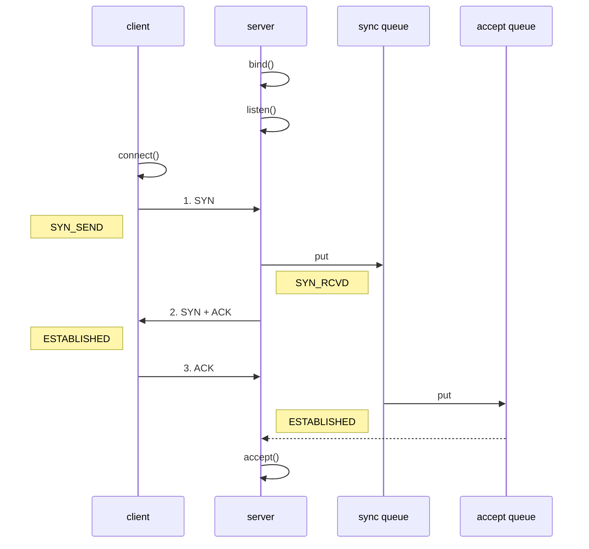

## 粘包半包


### 现象

**粘包**

* 现象，发送 `abc_def`，接收 `abcdef`
* 原因
  * 应用层：接收方 ByteBuf 设置太大（Netty 默认 1024）
  * 滑动窗口：假设发送方 256 bytes 表示一个完整报文，但由于接收方处理不及时且窗口大小足够大，这 256 bytes 字节就会缓冲在接收方的滑动窗口中，当滑动窗口中缓冲了多个报文就会粘包
  * Nagle 算法：也会造成粘包


**半包**

* 现象，发送 `abcdef`，接收 `abc_def`
* 原因
  * 应用层：接收方 ByteBuf 小于实际发送数据量
  * 滑动窗口：假设接收方的窗口只剩了 128 bytes，发送方的报文大小是 256 bytes，这时放不下了，只能先发送前 128 bytes，等待 ack 后才能发送剩余部分，这就造成了半包
  * MSS 限制：当发送的数据超过 MSS 限制后，会将数据切分发送，就会造成半包


**无论是粘包还是半包，本质原因在于 TCP 是一个无边界的流式协议。**


---
> **扩展1：MSS 限制**
>
>  * 链路层对一次能够发送的最大数据有限制，这个限制称之为 MTU（maximum transmission unit），不同的链路设备的 MTU 值也有所不同，例如
>
>   * 以太网的 MTU 是 1500
>   * FDDI（光纤分布式数据接口）的 MTU 是 4352
>   * 本地回环地址的 MTU 是 65535 - 本地测试不走网卡
>
>  * MSS 是最大段长度（maximum segment size），它是 MTU 刨去 tcp 头和 ip 头后剩余能够作为数据传输的字节数
>
>   * ipv4 tcp 头占用 20 bytes，ip 头占用 20 bytes，因此以太网 MSS 的值为 1500 - 40 = 1460
>   * TCP 在传递大量数据时，会按照 MSS 大小将数据进行分割发送
>   * MSS 的值在三次握手时通知对方自己 MSS 的值，然后在两者之间选择一个小值作为 MSS
>
>   


---

> **扩展2：Nagle 算法**
>
> * 即使发送一个字节，也需要加入 tcp 头和 ip 头，也就是总字节数会使用 41 bytes，非常不经济。因此为了提高网络利用率，tcp 希望尽可能发送足够大的数据，这就是 Nagle 算法产生的缘由
> * 该算法是指发送端即使还有应该发送的数据，但如果这部分数据很少的话，则进行延迟发送
>   * 如果 SO_SNDBUF 的数据达到 MSS，则需要发送
>   * 如果 SO_SNDBUF 中含有 FIN（表示需要连接关闭）这时将剩余数据发送，再关闭
>   * 如果 TCP_NODELAY = true，则需要发送
>   * 已发送的数据都收到 ack 时，则需要发送
>   * 上述条件不满足，但发生超时（一般为 200ms）则需要发送
>   * 除上述情况，延迟发送


### 解决方案


#### 短连接

发一个包建立一次连接，从连接的建立到断开就是消息的边界。

**缺点**

- 效率太低
- 无法解决半包问题，因为接收方的缓冲区大小仍然是有大小限制的


#### 定长消息

每条消息采用固定长度。

**服务端**

```java
// 注意先加 FrameDecoder, 再加 LoggingHandler
// 固定消息长度, 例如 8 Bytes
ch.pipeline().addLast(new FixedLengthFrameDecoder(8));
```

**客户端**

此时客户端可以在任何时候 flush

```java
byte[] bytes = fill10Bytes(c, r.nextInt(10) + 1);
buf.writeBytes(bytes);

public static byte[] fill10Bytes(char c, int len) {
    byte[] bytes = new byte[10];
    Arrays.fill(bytes, (byte) '_');
    for (int i = 0; i < len; i++) {
        bytes[i] = (byte) c;
    }
    return bytes;
}
```

**缺点**

数据包的大小不太好确定，如果太大，浪费资源，如果太小，不能满足某些大数据包的需求


#### 指定分隔符

每条消息采用固定的分隔符，默认是 `\n` 或 `\r\n`，如果超出指定长度仍未出现分隔符，则抛出异常。


**服务端**

```java
ch.pipeline().addLast(new LineBasedFrameDecoder(1024));
```


**客户端**

```java
StringBuilder sb = makeString(c, r.nextInt(16) + 1);
buf.writeBytes(sb.toString().getBytes());


public static StringBuilder makeString(char c, int len) {
    StringBuilder sb = new StringBuilder(len + 2);
    for (int i = 0; i < len; i++) {
        sb.append(c);
    }
    // 写入分隔符
    sb.append("\n");
    return sb;
}
```

**缺点**

适合处理字符数据，但如果内容本身包含了分隔符（字节数据常见情况），那么就会解析错误。


#### 声明长度

每条消息分为 head 和 body，定长的 head 中声明变长 body 的长度。有一定的开销，但综合性能和灵活性最好。

```java
public static void main(String[] args) {
    EmbeddedChannel channel = new EmbeddedChannel(
        // 参数1：最大长度
        // 参数2：长度域的偏移
        // 参数3：长度域占用字节
        // 参数4：长度域和数据域间隔
        // 参数5: 结果域的偏移
        new LengthFieldBasedFrameDecoder(1024, 1, 4, 1,6),
        new LoggingHandler(LogLevel.DEBUG)
    );

    //  4 个字节的内容长度， 实际内容
    ByteBuf buffer = ByteBufAllocator.DEFAULT.buffer();
    send(buffer, "Hello, world");
    send(buffer, "Hi!");
    channel.writeInbound(buffer);
}

private static void send(ByteBuf buffer, String content) {
    byte[] bytes = content.getBytes();
    int length = bytes.length;
    buffer.writeByte(1);
    buffer.writeInt(length);
    buffer.writeByte(1);
    buffer.writeBytes(bytes);
}
```


## 协议设计

TCP/IP 中消息传输基于流的方式，没有边界。而协议的目的就是划定消息的边界，制定通信双方要共同遵守的通信规则。一种直接的方法是给数据流加上**标点符号**，即分隔符，但分隔符本身如果用于传输，那么必须转义增加了复杂性。因此更为常用的是**消息头+消息体**的格式传输数据。


### 协议举例

**Redis 协议**

- 单行字符串 Simple Strings： 响应的首字节是 `+`
- 错误 Errors： 响应的首字节是 `-`
- 整型 Integers： 响应的首字节是 `:`
- 多行字符串 Bulk Strings： 响应的首字节是 `\$`
- 数组 Arrays： 响应的首字节是 `*`

> 参考：https://redis.com.cn/topics/protocol.html

```java
/**
 * 以 set name zhangsan 命令为例
 * *3
 * $3
 * set
 * $4
 * name
 * $8
 * zhangsan
 */
ByteBuf buf = ctx.alloc().buffer();
buf.writeBytes("*3".getBytes());
buf.writeBytes(LINE);
buf.writeBytes("$3".getBytes());
buf.writeBytes(LINE);
buf.writeBytes("set".getBytes());
buf.writeBytes(LINE);
buf.writeBytes("$4".getBytes());
buf.writeBytes(LINE);
buf.writeBytes("name".getBytes());
buf.writeBytes(LINE);
buf.writeBytes("$8".getBytes());
buf.writeBytes(LINE);
buf.writeBytes("zhangsan".getBytes());
buf.writeBytes(LINE);
ctx.writeAndFlush(buf);
```


**HTTP 协议**

HTTP 协议就更加复杂了，好在 Netty 内置了 HTTP 的编解码器。

```java
// 自动将一个 HTTP 请求解析成 HttpRequest 和 HttpContent 两个消息
ch.pipeline().addLast(new HttpServerCodec());

// 下面这个简单处理器仅处理 HttpRequest 并做出响应
ch.pipeline().addLast(new SimpleChannelInboundHandler<HttpRequest>() {
    @Override
    protected void channelRead0(ChannelHandlerContext ctx, HttpRequest msg) throws Exception {
        log.debug(msg.uri());
        
        DefaultFullHttpResponse response = new DefaultFullHttpResponse(msg.protocolVersion(), HttpResponseStatus.OK);
        byte[] bytes = "<h1>Hello, world!</h1>".getBytes();
        // 在响应头指定长度，否则浏览器会持续读取
        response.headers().setInt(HttpHeaderNames.CONTENT_LENGTH, bytes.length);
        response.content().writeBytes(bytes);
        
        ctx.writeAndFlush(response);
    }
});
```


### 自定义协议


#### 协议格式

* 魔数：用来在第一时间判定是否是无效数据包
* 版本号：可以支持协议的升级
* 序列化算法：消息正文到底采用哪种序列化反序列化方式，可以由此扩展，例如：json、protobuf、hessian、jdk
* 指令类型：是登录、注册、单聊、群聊... 跟业务相关
* 请求序号：为了双工通信，提供异步能力
* 正文长度
* 消息正文

```text
Protocol Format:
--------------------------------------------------------------
|  Magic   | Ver | Ser | Msg |   Seq    | Padding  |  Length |
|    4     |  1  |  1  |  1  |    4     |   0xFF   |    4    |
--------------------------------------------------------------
|                            Message Body                    |
--------------------------------------------------------------
```


#### 编解码器

针对上述协议格式的编解码器：

```java
@Slf4j
public class MessageCodec extends ByteToMessageCodec<Message> {
    @Override
    public void encode(ChannelHandlerContext ctx, Message msg, ByteBuf out) throws Exception {
        // 4Byte 魔数
        out.writeBytes(new byte[]{1, 2, 3, 4});
        // 1Byte 版本
        out.writeByte(1);
        // 1Byte 序列化方式 (0:JDK 1:Json)
        out.writeByte(0);
        // 1Byte 消息类型 (最大支持255种)
        out.writeByte(msg.getMessageType());
        // 4Byte 序列号
        out.writeInt(msg.getSequenceId());
        // Padding
        out.writeByte(0xff);
        
        ByteArrayOutputStream bos = new ByteArrayOutputStream();
        ObjectOutputStream oos = new ObjectOutputStream(bos);
        oos.writeObject(msg);
        byte[] bytes = bos.toByteArray();
        // 4Byte 长度（最长2^32）
        out.writeInt(bytes.length);
        
        // 实际消息内容
        out.writeBytes(bytes);
    }
    
    @Override
    protected void decode(ChannelHandlerContext ctx, ByteBuf in, List<Object> out) throws Exception {
        int magicNum = in.readInt();
        byte version = in.readByte();
        byte serializerType = in.readByte();
        byte messageType = in.readByte();
        int sequenceId = in.readInt();
        in.readByte();
        int length = in.readInt();
        
        byte[] bytes = new byte[length];
        in.readBytes(bytes, 0, length);
        ObjectInputStream ois = new ObjectInputStream(new ByteArrayInputStream(bytes));
        Message message = (Message) ois.readObject();
        
        log.debug("{}, {}, {}, {}, {}, {}", magicNum, version, serializerType, messageType, sequenceId, length);
        log.debug("{}", message);
        out.add(message);
    }
}
```


#### 测试

```java
EmbeddedChannel channel = new EmbeddedChannel(
    new LoggingHandler(LogLevel.DEBUG),
    // 经过该处理器时，如果没有收到完整的一帧将等待
    new LengthFieldBasedFrameDecoder(1024, 12, 4, 0, 0),
    new MessageCodec()
);

LoginRequestMessage message = new LoginRequestMessage("zhangsan", "123");


// encode test
channel.writeOutbound(message);


// decode test
ByteBuf buf = ByteBufAllocator.DEFAULT.buffer();
new MessageCodec().encode(null, message, buf);
channel.writeInbound(buf);

// 半包问题测试
ByteBuf s1 = buf.slice(0, 100);
ByteBuf s2 = buf.slice(100, buf.readableBytes() - 100);
s1.retain();              // refcnt + 1，防止 write 完 s1 后 s2 被销毁
channel.writeInbound(s1); // refcnt - 1
Thread.sleep(2000);
channel.writeInbound(s2);
```

在半包问题的测试代码中，通过打印的日志可以发现，如果一个帧的数据包没到齐，`LengthFieldBasedFrameDecoder`会等完整的帧到达后再发送给后续的 `MessageCodec`。


#### @Sharable

在Netty中，`@Sharable` 注解用于标记一个 `ChannelHandler` 是否是可共享的。当一个 `ChannelHandler` 被标记为 `@Sharable`，意味着它是线程安全的，可以被多个 `Channel` 共享，而无需为每个 `Channel` 实例化一个新的 `ChannelHandler`，避免频繁创建的开销。

但应确保被标记为 `@Sharable` 的 `ChannelHandler` 是无状态的，或者是线程安全的，以避免并发访问导致的问题。

```java
// 日志处理器是无状态的，因此可以共享
@Sharable
public class LoggingHandler extends ChannelDuplexHandler { ... }

// Netty 限制了 ByteToMessageCodec 的子类不能共享
public class MessageCodec extends ByteToMessageCodec<Message> { ... }

// 如果能确保编解码器不会保存状态，可以继承 MessageToMessageCodec 父类
@Sharable
public class MessageCodecSharable extends MessageToMessageCodec<ByteBuf, Message> { ... }
```

::: warning

如果一个未被标记 `@Sharable` 的 handler 已经用于处理某个 channel 了，那么后续依赖该 handler 的其它 channel 将无法建立连接。

:::


## 实战 -- 聊天室 & RPC

[https://github.com/xchanper/Chatting](https://github.com/xchanper/Chatting)

重点关注 Handler 的交互处理、事件的处理、RPC 请求和结果处理。


## 参数调优


### 参数配置

```java
// 服务端使用 option 给 ServerSocketChannel 配置参数
// 服务端使用 childOption 给 SocketChannel 配置参数
new ServerBootstrap()
        .option(ChannelOption.SO_TIMEOUT, 10)
        .childOption(ChannelOption.SO_KEEPALIVE, true);


// 客户端使用 option 给 SocketChannel 配置参数
new Bootstrap().option(ChannelOption.SO_TIMEOUT, 10)
```


### CONNECT_TIMEOUT_MILLIS

属于 SocketChannal 参数，用在客户端建立连接时，如果在指定毫秒内无法连接，会抛出 timeout 异常

`bootstrap.option(ChannelOption.CONNECT_TIMEOUT_MILLIS, 300)`

区别于 `SO_TIMEOUT` 用于阻塞 IO。阻塞 IO 中 accept，read 等都是无限等待的，如果不希望永远阻塞，使用它调整超时时间


### SO_BACKLOG

属于 ServerSocketChannal 参数，指定了服务器端监听队列（通常就是半连接队列）的最大长度，溢出队列的请求将被拒绝，实际中应根据服务器的负载和性能进行调优。

`serverBootstrap.option(ChannelOption.SO_BACKLOG, 128)`

回顾一下 OS 进行 TCP 连接握手的过程：



1. 第一次握手，client 发送 SYN 到 server，状态修改为 SYN_SEND，server 收到，状态改变为 SYN_REVD，并将该请求放入 sync queue 队列
2. 第二次握手，server 回复 SYN + ACK 给 client，client 收到，状态改变为 ESTABLISHED，并发送 ACK 给 server
3. 第三次握手，server 收到 ACK，状态改变为 ESTABLISHED，将该请求从 sync queue 放入 accept queue

其中：
- **sync queue** 也称半连接队列，在这个队列中的 TCP 连接仅建立了一部分
  - `netstat -an`命令结果中展示为 `SYN_RECV` 状态
  - 大小由 `/proc/sys/net/ipv4/tcp_max_syn_backlog`指定
- **accept queue** 也称全连接队列，保存了所有完全建立好的 TCP 连接
  - `netstat -an`命令结果中展示为 `ESTABLISHED` 状态
  - 大小由 `/proc/sys/net/core/somaxconn`指定
  - 如果 accpet queue 队列满了，server 将返回一个拒绝连接的错误信息给 client


### ulimit -n

属于 OS 的参数，用于设置或显示当前用户打开的文件描述符限制，包括打开的文件、网络连接等，默认 1024。

`ulimit -n <限制数>`


### TCP_NODELAY


属于 SocketChannal 参数，是 TCP 协议的一个选项，用于是否禁用 Nagle 算法。

`bootstrap.option(ChannelOption.TCP_NODELAY, false)`


开启 Nagle 能够减少网络中小分组的数量，提高网络的效率，但实时性较差。关闭 Nagle 可以尽快发出数据包，降低延迟，适合实时游戏、视频通话等需要即时响应的场景。


### SO_SNDBUF & SO_RCVBUF

- SO_SNDBUF 属于 SocketChannel 参数，用于设置套接字发送缓冲区（存储待发送数据）的大小
- SO_RCVBUF 既可用于 SocketChannel，也可用于 ServerSocketChannel，用于设置套接字接收缓冲区（存储已接受尚未处理的数据）的大小

实际中，需要根据具体的网络环境和应用需求来进行调优，避免因为缓冲区溢出或者缓冲区太小导致的性能问题。


### ALLOCATOR

属于 SocketChannel 参数，决定分配内存的方式是`PooledByteBufAllocator`还是`UnpooledByteBufAllocator`。如果没有通过`-Dio.netty.allocator.type=pooled|unpooled`指定，则安卓平台默认非池化，其它平台默认池化分配器。

实际中，根据需求选择使用 PooledByteBufAllocator 或 UnpooledByteBufAllocator。如果需要处理大量的长期连接，而且内存使用频繁，那么使用 PooledByteBufAllocator 可能更加高效。但如果连接都是短暂的，内存需求不是很大，那么使用 UnpooledByteBufAllocator 可能更合适。


### RCVBUF_ALLOCATOR

属于 SocketChannel 参数，用于配置接收缓冲区的大小，常用的有:
- **AdaptiveRecvByteBufAllocator**: 默认值，能够根据网络连接的特性和当前的网络条件动态调整接收缓冲区的大小，以优化性能
- **FixedRecvByteBufAllocator**: 可以指定大小，分配固定大小的接收缓冲区

大多数情况下推荐使用**AdaptiveRecvByteBufAllocator**，自适应调节策略可以在不同网络环境下都能保持较好的性能。


## 源码分析


### 启动流程

Netty 说白了是对原始 Java-NIO 的二次开发和优化，因此底层还是 NIO 的开发范式。先回顾一下开发一个 NIO 服务器的基本步骤： 


```java
// 1. 创建 Selector
Selector selector = Selector.open();

// 2. 创建 ssc，并配置非阻塞
ServerSocketChannel ssc = ServerSocketChannel.open();
ssc.configureBlocking(false);

// 3. 关联 selector、ssc，并注册感兴趣事件
SelectionKey sscKey = ssc.register(selector, 0, null);

// 4. 绑定端口
ssc.bind(new InetSocketAddress(8080));

// 5. 注册感兴趣事件
sscKey.interestOps(SelectionKey.OP_ACCEPT);
```


然后跟踪源码，看看 Netty 是如何完成这几个步骤的。NioEventLoop 里面包含了 Selector 的开启，即 Java—NIO 的第1步，这个放到 NioEventLoop 中详细分析。下面的 group(), channel(), childHandler() 等方法都是配置 ServerBootstrap 的方法，关键逻辑在 bind() 方法里面。

```java
new ServerBootstrap()
    .group(new NioEventLoopGroup(1), new NioEventLoopGroup(2))
    .channel(NioServerSocketChannel.class)
    .childHandler(new ChannelInitializer<>() { ... })
    .bind(8080);
```

启动流程主要涉及两个线程: **Main 主线程**、**NioEventLoop 线程**。ServerBootstrap 执行 bind，进入 `initAndRegister()`后，里面分为 **init()** 和 **register()** 两个步骤。


#### Init

init 之前会创建 ServerSocketChannel，即 Java-NIO 的第2步。然后 init() 负责初始化通道的参数配置，并为 ServerSocketChannel 添加 ChannelInitializer 准备执行（添加 ServerBootstrapAcceptor 处理子Channel）

```java
// io.netty.bootstrap.AbstractBootstrap#initAndRegister
channel = channelFactory.newChannel();
init(channel);


// io.netty.channel.socket.nio.NioServerSocketChannel#newSocket
private static ServerSocketChannel newSocket(SelectorProvider provider) {
    try {
        return provider.openServerSocketChannel();
    } catch (IOException e) {
        throw new ChannelException("Failed to open a server socket.", e);
    }
}
```

#### Register

register() 会启动 NIO-boss 线程去关联 ssc 和 selector，并初始化 Pipeline、Handler，即执行上面的 ChannelInitializer。(此时 pipeline 为 **head -> ServerBootstrapAcceptor -> tail**)

```java
// io.netty.channel.AbstractChannel.AbstractUnsafe#register
eventLoop.execute(new Runnable() {
    @Override
    public void run() {
        register0(promise);
    }
});
```

注意：register 方法的第三个参数是 attachment 附件，在 Netty 的实现里就是 NioServerSocketChannel

```java
// io.netty.channel.nio.AbstractNioChannel#doRegister
@Override
protected void doRegister() throws Exception {
    boolean selected = false;
    for (;;) {
        try {
            // 即 Java-NIO 的第3步：关联 selector、ssc，并注册感兴趣事件
            selectionKey = javaChannel().register(eventLoop().unwrappedSelector(), 0, this);
            return;
        } catch (CancelledKeyException e) {
            if (!selected) {
                eventLoop().selectNow();
                selected = true;
            } else {
                throw e;
            }
        }
    }
}
```


#### Bind

register 方法执行完成后开始真正的 bind，层层调用最后到达 `NioServerSocketChannel#doBind`

```java
// io.netty.channel.socket.nio.NioServerSocketChannel#doBind
@Override
protected void doBind(SocketAddress localAddress) throws Exception {
    if (PlatformDependent.javaVersion() >= 7) {
        // 即 Java-NIO 的第4步：关联 selector、ssc
        javaChannel().bind(localAddress, config.getBacklog());
    } else {
        javaChannel().socket().bind(localAddress, config.getBacklog());
    }
}
```


#### InterestOps

doBind 绑定完成后，会触发所有 handler 的 channelActive 方法，在 HeadContext 的 channelActive() 方法里会执行 Java-NIO 的第5步注册感兴趣事件，默认是关注`OP_ACCEPT`：

```java
// io.netty.channel.nio.AbstractNioChannel#doBeginRead
@Override
protected void doBeginRead() throws Exception {
    final SelectionKey selectionKey = this.selectionKey;
    if (!selectionKey.isValid()) {
        return;
    }

    readPending = true;

    final int interestOps = selectionKey.interestOps();
    // readInterestOp = 16，即 SelectionKey.OP_ACCEPT
    if ((interestOps & readInterestOp) == 0) {
        selectionKey.interestOps(interestOps | readInterestOp);
    }
}
```

至此完成了 Java-NIO 的5个关键步骤，也完成了 Netty 服务端的启动流程。


### NioEventLoop


NioEventLoop 是 Netty 的一个核心类，包括很多重要的逻辑操作。


#### 成员对象

1. 两个 Selector 对象
   - selector：基于数组存储 SelectionKey 实现的 Selector 
   - unwrappedSelector: 基于 HashSet 存储 SelectionKey 实现的 Selector，也即原始的 `java.nio.channels.Selector`

2. 继承自 SingleThreadEventExecutor 的线程对象 thread 和所属的单线程 Executor

3. 暂存任务的任务队列，NioEventLoop 不仅可以处理 IO 事件，也可以处理普通任务和定时任务
   - `Queue<Runnable>`普通任务队列
   - `PriorityQueue<ScheduledFutureTask<?>>`定时任务


#### 构造方法

NioEventLoop 内部使用 `unwrappedSelector` 进行底层的选择操作，而对外提供的接口是通过 `selector` 进行的，额外添加了处理空轮询问题、资源释放等功能，使得 Netty 能够提供更好的性能和稳定性。

```java
// io.netty.channel.nio.NioEventLoop#NioEventLoop
NioEventLoop(NioEventLoopGroup parent, Executor executor, SelectorProvider selectorProvider,
                SelectStrategy strategy, RejectedExecutionHandler rejectedExecutionHandler,
                EventLoopTaskQueueFactory queueFactory) {
    
    super(parent, executor, false, newTaskQueue(queueFactory), newTaskQueue(queueFactory), rejectedExecutionHandler);
    
    ...

    provider = selectorProvider;
    final SelectorTuple selectorTuple = openSelector();
    selector = selectorTuple.selector;
    unwrappedSelector = selectorTuple.unwrappedSelector;
    selectStrategy = strategy;
}


// io.netty.channel.nio.NioEventLoop#openSelector
private SelectorTuple openSelector() {
    try {
        // 此处即执行了 Java-NIO 的第1步，开启 Selector
        unwrappedSelector = provider.openSelector();
    } catch (IOException e) {
        throw new ChannelException("failed to open a new selector", e);
    }

    ...
}
```


#### 启动线程

NioEventLoop 首次调用 execute() 时（事件触发）将启动 NIO 线程，并且通过状态变量保证只启动一次。

```java
// io.netty.util.concurrent.SingleThreadEventExecutor#doStartThread
private void doStartThread() {
    assert thread == null;
    executor.execute(new Runnable() {
        @Override
        public void run() {
            // thread 对象即 executor 线程池里的那个唯一线程
            thread = Thread.currentThread();

            ...

            try {
                // 进入死循环，监测普通任务、定时任务、IO事件
                SingleThreadEventExecutor.this.run();
            } catch (Throwable t) {
                ...
            }
        }
    });
}
```


#### 监听事件

```java
// io.netty.channel.nio.NioEventLoop#run
@Override
protected void run() {
    for (;;) {
        // 选择策略：
        // 队列里没有任务时，走 SELECT 分支阻塞；
        // 队列里有任务时，则执行 selector.selectNow() 以非阻塞方式拿到所有 IO 事件
        switch (selectStrategy.calculateStrategy(selectNowSupplier, hasTasks())) {
            case SelectStrategy.CONTINUE:
                continue;

            case SelectStrategy.BUSY_WAIT:

            case SelectStrategy.SELECT:
                select(wakenUp.getAndSet(false));
                if (wakenUp.get()) {
                    selector.wakeup();
                }
            
            default:
        }


        // 控制处理 IO 事件所占用的时间比例，默认50%
        final int ioRatio = this.ioRatio;
        // 处理 IO 事件
        processSelectedKeys();
        // 处理普通任务
        runAllTasks(ioTime * (100 - ioRatio) / ioRatio);
    }
}
```


#### 处理事件

```java
// io.netty.channel.nio.NioEventLoop#processSelectedKey(java.nio.channels.SelectionKey, io.netty.channel.nio.AbstractNioChannel)
private void processSelectedKey(SelectionKey k, AbstractNioChannel ch) {
    final AbstractNioChannel.NioUnsafe unsafe = ch.unsafe();

    ...

    // 处理不同的 IO 事件
    int readyOps = k.readyOps();
    if ((readyOps & SelectionKey.OP_CONNECT) != 0) {
        int ops = k.interestOps();
        ops &= ~SelectionKey.OP_CONNECT;
        k.interestOps(ops);
        unsafe.finishConnect();
    }

    if ((readyOps & SelectionKey.OP_WRITE) != 0) {
        ch.unsafe().forceFlush();
    }

    if ((readyOps & (SelectionKey.OP_READ | SelectionKey.OP_ACCEPT)) != 0 || readyOps == 0) {
        unsafe.read();
    }
}
```


**处理 OP_ACCEPT**

执行 `unsafe.read()` 后，接受连接，创建 SocketChannel 后执行 handler 链。

```java
// io.netty.channel.nio.AbstractNioMessageChannel.NioMessageUnsafe#read

public void read() {
    do {
        // 处理 accept，创建 NioSocketChannel
        int localRead = doReadMessages(readBuf);
        ...
    } while (allocHandle.continueReading());
    
    int size = readBuf.size();
    for (int i = 0; i < size; i ++) {
        readPending = false;
        // 开始调用 handler 链的 channelRead 方法
        pipeline.fireChannelRead(readBuf.get(i));
    }
    ...
    allocHandle.readComplete();
    pipeline.fireChannelReadComplete();
}


// io.netty.channel.socket.nio.NioServerSocketChannel#doReadMessages
protected int doReadMessages(List<Object> buf) throws Exception {
    // 此处即执行 ssc.accept()
    SocketChannel ch = SocketUtils.accept(javaChannel());
    if (ch != null) {
        buf.add(new NioSocketChannel(this, ch));
        return 1;
    }
   
    ...
    return 0;
}
```

ServerSocketChannel 的调用链是 **head -> ServerBootstrapAcceptor -> tail**，由 acceptor 负责处理连接的 accpt 事件，执行和 ServerSocketChannel 类似的 register 流程（启动流程步骤-2）。只不过这次是 SocketChannel 的启动，也是要新建 NIO 线程，为 SocketChannel 执行用户自定义的 ChannelInitializer。
```java
// io.netty.bootstrap.ServerBootstrap.ServerBootstrapAcceptor#channelRead
public void channelRead(ChannelHandlerContext ctx, Object msg) {
    final Channel child = (Channel) msg;
    child.pipeline().addLast(childHandler);

    try {
        // 注册流程，和启动流程类似
        childGroup.register(child).addListener(new ChannelFutureListener() {
            @Override
            public void operationComplete(ChannelFuture future) throws Exception {
                if (!future.isSuccess()) {
                    forceClose(child, future.cause());
                }
            }
        });
    } catch (Throwable t) {
        forceClose(child, t);
    }
}
```

完成后触发`pipeline.fireChannelActive()`注册 read 事件（启动流程步骤-4），结束 Accpet 事件的处理。 


**处理 OP_READ**

同样的，触发 read 事件后，读取数据最后交由 Pipeline 里面用户自定义的各个 Handler 依次加工数据，完成 Read 事件处理。

```java
// io.netty.channel.nio.AbstractNioByteChannel.NioByteUnsafe#read
public final void read() {

    ...

    ByteBuf byteBuf = null;
    do {
        byteBuf = allocHandle.allocate(allocator);
        // 基于底层 Java-NIO，将数据读入 byteBuf
        allocHandle.lastBytesRead(doReadBytes(byteBuf));
        
        ...

        // 依次经过各个 Handler 加工
        pipeline.fireChannelRead(byteBuf);
        byteBuf = null;
    } while (allocHandle.continueReading());

    allocHandle.readComplete();
    pipeline.fireChannelReadComplete();
}
```