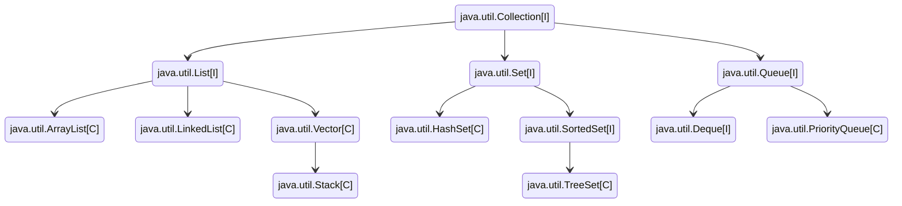
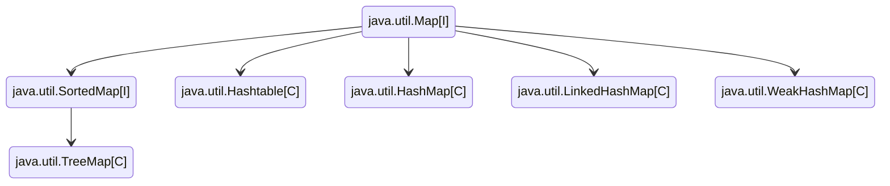
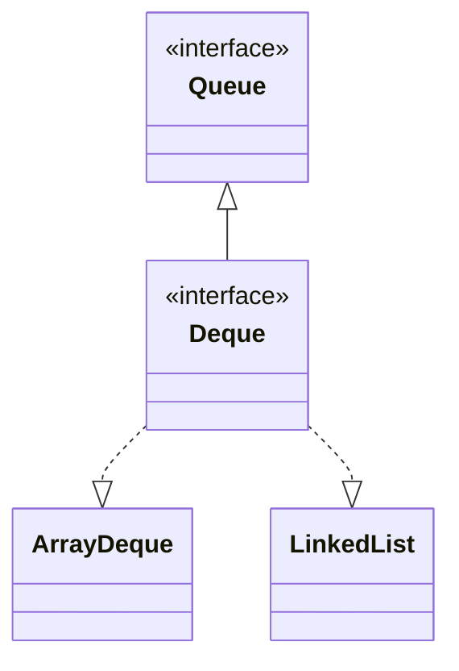

<!--more-->


## 数据结构




\[I]: 接口 
\[C]: 类
其中，Vector、Stack、HashTable线程安全，但已经基本不用了。

### 数组 - Array或ArrayList
- get和set操作时间上都是O(1)
- add和remove都是O(N)
- ArrayList添加元素不必考虑越界，超出容量时自动扩张
- Vector相比于ArrayList，实现了线程安全，但效率较低

### 链表 - LinkedList
- get和set操作时间上都是O(N)
- add和remove都是O(1)
```java
LinkedList<String> linkedList = new LinkedList<>();
linkedList.add("addd");//add
linkedList.set(0,"s"); //set，必须先保证 linkedList中已经有第0个元素
String s =  linkedList.get(0);//get
linkedList.contains("s");//查找
linkedList.remove("s");//删除
// 以上方法也适用于ArrayList
```

### 栈 - ArrayDeque
- Stack实现了后进先出，但继承自Vector，线程安全但效率低，因此不推荐使用
- ArrayDeque实现了Deque，可以作为栈（但仍可以违反栈的单端操作规则）
```java
Deque<Integer> stack = new ArrayDeque<Integer>();
stack.push(12);//尾部入栈
stack.push(16);//尾部入栈
int tail = stack.pop();//尾部出栈，并删除该元素
tail = stack.peek();//尾部出栈，不删除该元素
```

### 队列 - LinkedList
- LinkedList实现了Deque，可以作为双向/单向队列
- PriorityQueue实现了带优先级的队列
```java
Deque<Integer> deque = new LinkedList<>();
// 尾部入队，区别在于如果失败了，add方法会抛出一个IllegalStateException异常，而offer方法返回false
deque.offer(122);
deque.add(122);
// 头部出队，区别在于如果失败了，remove方法抛出一个NoSuchElementException异常，而poll方法返回false
int head = deque.poll();//删除第一个元素并返回
head = deque.remove();  //删除第一个元素并返回
// 头部出队，区别在于如果失败了，element方法抛出一个NoSuchElementException异常，而peek方法返回null。
head = deque.peek();    //返回第一个元素，不删除
head = deque.element(); //返回第一个元素，不删除
```

### 双端队列 - Deque
- ArrayDeque基于数组实现了双端队列
- LinkedList基于双向链表实现了双端队列
- 另有两个线程安全的实现类：ConcurrentLinkedDeque, LinkedBlockingDeque

- Deque和Queue提供了两套API，一种抛出异常，另一种返回特殊值
- Deque中add(), offer()都是队尾加入元素，而push()队头加入元素。
- Deque中的peek(), element(), poll(), remove(), pop()都是从队头取元素。尽量不混用
- Deque额外提供了First、Last后缀的方法。
    | 操作类型 | 抛出异常 | 返回特殊值 |
    | :-----: | :-----: | :-----: |
    | 插入 | add(e) | offer(e) |
    | 移除 | remove() | poll() |
    | 拾取 | element() | peek() |


## 快排

[LeetCode 912. 排序数组](https://leetcode.cn/problems/sort-an-array/description/)

```java
class Solution {

    private static Random rand = new Random(System.currentTimeMillis());

    public int[] sortArray(int[] nums) {
        quickSort(nums, 0, nums.length - 1);
        return nums;
    }

    private void quickSort(int[] nums, int left, int right) {
        if(left >= right)
            return;

        int r = rand.nextInt(right - left + 1);
        swap(nums, left, left + r);

        int pivot = left;
        int lt = left, gt = right;
        while(true) {
            while(lt <= right && nums[lt] < nums[pivot])    lt++;
            while(gt >= left && nums[gt] > nums[pivot])     gt--;
            
            if(lt >= gt)    break;
            
            swap(nums, lt++, gt--);
        }

        swap(nums, pivot, gt);
        quickSort(nums, left, gt - 1);
        quickSort(nums, gt + 1, right);
    }


    private void swap(int[] nums, int i, int j) {
        int tmp = nums[i];
        nums[i] = nums[j];
        nums[j] = tmp;
    }
}
```

## 滑动窗口
```java
public void slidingWindow(string s) {
    Map<Character, Integer> window = new HashMap<>();
    
    // 窗口左闭右开 [left, right)
    int left = 0, right = 0;
    while (right < s.length()) {
        // c 是将移入窗口的字符，同时增大窗口
        char c = s.charAt(right++);

        // 进行窗口内数据的一系列更新
        ...

        /*** debug 输出的位置 ***/
        System.out.println(s.substring(left, right));
        /***********************/
        
        // 判断左侧窗口是否要收缩
        while (window needs shrink) {
            // d 是将移出窗口的字符，同时缩小窗口
            char d = s.charAt(left++);
            
            // 进行窗口内数据的一系列更新
            ...
        }
    }
}
```


## KMP

```java
// 构建next数组
int[] next = new int[p.length];
next[0] = -1;
int i = 0, j = -1;
while (i < p.length - 1) {
    if (j == -1 || p[i] == p[j]) {
        ++i;
        ++j;
        next[i] = j;
    } else
        j = next[j];
}

// 匹配
i = 0;
j = 0;
while (i < s.length && j < p.length) {
    if (j == -1 || s[i] == p[j]) {
        ++i;
        ++j;
    } else
        j = next[j];
}

if (j == p.length)
    return i - j;
else
    return -1;
```

## 动态规划


### 最长回文子串

[LeetCode 5. 最长回文子串](https://leetcode.cn/problems/longest-palindromic-substring/)

**DP**

关键先遍历长度，再遍历左边界，确保`dp[left + 1][right - 1]`先被计算。

```java
class Solution {
    public String longestPalindrome(String s) {
        int n = s.length();
        if(n < 2)
            return s;
        
        // s[i:j] is palindrome or not
        boolean[][] dp = new boolean[n][n];
        for(int i = 0; i < n; i++)
            dp[i][i] = true;
        
        // enumerate length
        String ans = s.substring(0, 1);
        for(int len = 2; len <= n; len++) {
            // enumerate left bound
            for(int left = 0; left < n; left++) {
                int right = left + len - 1;
                if(right >= n)
                    break;
                
                if(s.charAt(left) != s.charAt(right)){
                    dp[left][right] = false;
                } else {
                    if(right - left < 3){
                        dp[left][right] = true;
                    } else {
                        dp[left][right] = dp[left + 1][right - 1];
                    }
                }

                // update ans
                if(dp[left][right] && right - left + 1 > ans.length()) {
                    ans = s.substring(left, right + 1);
                }
            }
        }

        return ans;
    }
}
```

**中心扩展**

关键在于奇偶分别扩展求最长。

```java
class Solution {
    public String longestPalindrome(String s) {
        int n = s.length();
        String res = "";
        for(int i = 0; i < n; i++) {
            String s1 = centerAround(s, i, i);
            String s2 = centerAround(s, i, i + 1);
            
            res = res.length() > s1.length() ? res : s1;
            res = res.length() > s2.length() ? res : s2;
        }

        return res;
    }

    private static String centerAround(String s, int left, int right) {
        while(left >= 0 && right < s.length() && s.charAt(left) == s.charAt(right)) {
            left--;
            right++;
        }
        return s.substring(left + 1, right);
    }
}
```


### 最长上升子序列 - DP

```java
public int lengthOfLIS(int[] nums) {
    if(nums.length == 0)
        return 0;
    
    // 以nums[i]结尾的最长上升子序列长度
    int[] dp = new int[nums.length];
    dp[0] = 1;
    int ans = 0;

    for (int i = 1; i < dp.length; i++) {
        dp[i] = 1;
        for (int j = 0; j < i; j++) 
            if(nums[i] > nums[j])
                dp[i] = Math.max(dp[i], dp[j] + 1);

        ans = Math.max(ans,dp[i]);
    }

    return ans;
}
```

### 最长上升子序列 - 贪心+二分
```java
public int lengthOfLIS(int[] nums) {
    if(nums.length == 0)
        return 0;

    // 长度为k的最长上升子序列末尾元素的值,同等长度下应尽可能小
    int[] tails = new int[nums.length];
    int len = 0;

    for (int num : nums) {
        int left = 0, right = len;
        while(left < right) {
            int mid = (left + right) / 2;
            if(tails[mid] < num)
                left = mid + 1;
            else 
                right = mid;
        }
        tails[left] = num;
        if(len == right)
            len++;
    }

    return len;
}
```


### 最长公共子序列

[LeetCode 1143. 最长公共子序列](https://leetcode.cn/problems/longest-common-subsequence/description/)

- S1[i] == S2[j]，则 
  $$ LCS(S1[0:i], S2[0:j]) = LCS(S1[0:i-1], S2[0:j-1])+1 $$
- S1[i] != S2[j]，则 
  $$ LCS(S1[0:i], S2[0:j]) =  max\left\{ LCS(S1[0:i-1], S2[0:j]), LCS(S1[0:i], S2[0:j-1]) \right\} $$

```java
public int longestCommonSubsequence(String text1, String text2) {
    int m = text1.length();
    int n = text2.length();

    int[][] dp = new int[m + 1][n + 1];
    for(int i = 1; i <= m; i++){
        for(int j = 1; j <= n; j++) {
            if(text1.charAt(i - 1) == text2.charAt(j - 1))
                dp[i][j] = dp[i-1][j-1] + 1;
            else
                dp[i][j] = Math.max(dp[i-1][j], dp[i][j-1]);
        }
    }


    // 附加：输出序列
    StringBuilder sb = new StringBuilder();
    for(int i = m; i >= 1; i--){
        for(int j = n; j >= 1; j--) {
            if(dp[i][j] > dp[i-1][j] && dp[i][j] > dp[i][j-1])
                sb.append(text1.charAt(i-1));
        }
    }
    System.out.println(sb.reverse().toString());


    return dp[m][n];
}
```


## 搜索


### 二分查找

二分查找中，关键在于注意 **循环不变量** 规则，看自己定义的 target 区间是`[left, right]` 还是 `[left, right)`，进而才能判断清楚结束条件到底是 left <= right 还是 left < right，修改区间时是 right = mid - 1 还是 right = mid。

```java
// 普通二分
int binary_search(int[] nums, int target) {
    int left = 0, right = nums.length - 1; 
    while(left <= right) {
        int mid = left + (right - left) / 2;
        if (nums[mid] < target) {
            left = mid + 1;
        } else if (nums[mid] > target) {
            right = mid - 1; 
        } else if(nums[mid] == target) {
            // 直接返回
            return mid;
        }
    }
    // 直接返回
    return -1;
}

// 搜索左边界
int left_bound(int[] nums, int target) {
    int left = 0, right = nums.length - 1;
    while (left <= right) {
        int mid = left + (right - left) / 2;
        if (nums[mid] < target) {
            left = mid + 1;
        } else if (nums[mid] > target) {
            right = mid - 1;
        } else if (nums[mid] == target) {
            // 别返回，锁定左侧边界
            right = mid - 1;
        }
    }
    // 判断 target 是否存在于 nums 中
    // 此时 target 比所有数都大，返回 -1
    if (left == nums.length) return -1;
    // 判断一下 nums[left] 是不是 target
    return nums[left] == target ? left : -1;
}

// 搜索右边界
int right_bound(int[] nums, int target) {
    int left = 0, right = nums.length - 1;
    while (left <= right) {
        int mid = left + (right - left) / 2;
        if (nums[mid] < target) {
            left = mid + 1;
        } else if (nums[mid] > target) {
            right = mid - 1;
        } else if (nums[mid] == target) {
            // 别返回，锁定右侧边界
            left = mid + 1;
        }
    }
    // 此时 left - 1 索引越界
    if (left - 1 < 0) return -1;
    // 判断一下 nums[left] 是不是 target
    return nums[left - 1] == target ? (left - 1) : -1;
}
```

### 二叉树

二叉树的解题模式分两类：1.遍历一遍二叉树；2.定义递归分解问题。两类思想又分别对应回溯算法和动态规划。

注：递归的时间复杂度 = 递归次数 * 单次执行时间

前中后序是遍历二叉树过程中处理每一个节点的三个特殊时间点。三种遍历中，前序位置的代码只能从函数参数中获取父节点传递来的参数，而后序遍历代码不仅可以获取参数数据，还可以获取到子树通过函数返回值传递回来的数据。因此，对于涉及子树的问题，大概率要给函数设置合理的定义和返回值，在后序位置写巧妙的代码。


### DFS
```java
void dfs(TreeNode root) {
    // 判断 base case
    if (root == null) 
        return;

    // 树型：访问两个相邻节点：左右子节点
    dfs(root.left);
    dfs(root.right);

    // 网格型：访问上、下、左、右四个相邻结点
    dfs(grid, r - 1, c);
    dfs(grid, r + 1, c);
    dfs(grid, r, c - 1);
    dfs(grid, r, c + 1);
}
```

### BFS
```java
void bfs(TreeNode root) {
    Queue<TreeNode> queue = new ArrayDeque<>();
    queue.add(root);
    while (!queue.isEmpty()) {
        // 分层/多源：队列长度即当前层结点个数
        int n = queue.size();
        for (int i = 0; i < n; i++) {
            TreeNode node = queue.poll();
            // 将符合条件的扩展结点加入队列
            if (node.left != null) 
                queue.add(node.left);
            if (node.right != null) 
                queue.add(node.right);
        }
    }
}
```
> 定义depth层数，并在**入队前**标记已访问，即可用于图BFS/多源BFS求最短路问题 (root即超级源点)


## LRU

[LeetCode 146. LRU 缓存](https://leetcode.cn/problems/lru-cache/)

```java
class LRUCache {

    private class DLinkedNode {
        DLinkedNode prev, next;
        int key, val;

        DLinkedNode() {}

        DLinkedNode(int key, int val) {
            this.key = key;
            this.val = val;
        }
    }

    Map<Integer, DLinkedNode> cache;
    DLinkedNode head, tail;
    int capacity;

    public LRUCache(int capacity) {
        cache = new HashMap<>();
        head = new DLinkedNode();
        tail = new DLinkedNode();
        head.next = tail;
        tail.prev = head;
        this.capacity = capacity;
    }
    
    public int get(int key) {
        DLinkedNode node = cache.get(key);
        if(node == null)
            return -1;
        moveToHead(node);
        return node.val;
    }
    
    public void put(int key, int value) {
        DLinkedNode node = cache.get(key);
        if(node != null) {
            node.val = value;
            moveToHead(node);
        } else {
            node = new DLinkedNode(key, value);
            cache.put(key, node);
            addToHead(node);
            
            if(cache.size() > capacity) {
                DLinkedNode removed = removeTail();
                cache.remove(removed.key);
            }
        }
    }

    private void addToHead(DLinkedNode node) {
        node.prev = head;
        node.next = head.next;
        head.next.prev = node;
        head.next = node;
    }

    private void moveToHead(DLinkedNode node) {
        removeNode(node);
        addToHead(node);
    }

    private DLinkedNode removeTail() {
        DLinkedNode node = tail.prev;
        removeNode(node);
        return node;
    }

    private void removeNode(DLinkedNode node) {
        node.prev.next = node.next;
        node.next.prev = node.prev;
    }
}

/**
 * Your LRUCache object will be instantiated and called as such:
 * LRUCache obj = new LRUCache(capacity);
 * int param_1 = obj.get(key);
 * obj.put(key,value);
 */
```