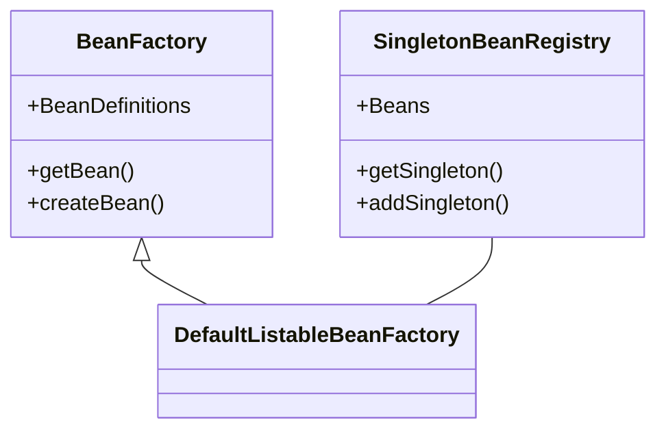

项目地址：[https://github.com/xchanper/MySpring](https://github.com/xchanper/MySpring)

参考文档：[https://github.com/fuzhengwei/small-spring](https://github.com/fuzhengwei/small-spring)

进度：
- ✅ IoC
- ✅ AOP
- ✅ 其它

## IoC 部分

### BeanFactory 类图

完整版类图：


简化版类图如下，主要间接继承 BeanFactory 和 SingletonBeanRegistry 两个接口。



- BeanFactory 主要负责注册 BeanDefinition
  - 里面有一个 Map 存储 BeanName 和 BeanDefinition 的映射关系
  - BeanDefinition 内部存储了 Bean 的全限定类名
- SingletonBeanRegistry 主要负责存储单例 Bean 实例对象
  - 里面有一个 Map 存储 BeanName 和 Bean 实例对象的映射
  - 当程序需要 getBean 的时候，从单例池中获取，没有就从 BeanFactory 中获得 BeanDefinition 后创建实例对象，放入单例池并返回
  - 而对于非单例的 Bean，每次都创建新实例对象，不放入单例池，直接返回


### 策略设计模式

在策略模式（Strategy Pattern）中，一个类的行为或其算法可以在运行时更改。这种类型的设计模式属于行为型模式。

#### 资源加载策略

根据需要，项目提供了三种资源解析器，分别从 ClassPath、本地文件、云文件 三种资源加载 BeanDefinition。Resource 接口定义了 getInputStream() 方法来获得资源的输入流，ClassPathResource, FileSystemResource, UrlResource 三种资源类实现了该接口，进而可以从不同的位置获得资源配置的输入流。

```java
// ClassPathResource
@Override
public InputStream getInputStream() throws IOException {
    InputStream is = classLoader.getResourceAsStream(path);
    if (is == null) {
        throw new FileNotFoundException(this.path + " cannot be opened because it does not exist");
    }
    return is;
}

// FileSystemResource
@Override
public InputStream getInputStream() throws IOException {
    return new FileInputStream(file);
}

// UrlResource
@Override
public InputStream getInputStream() throws IOException {
    URLConnection con = url.openConnection();
    try {
        return con.getInputStream();
    } catch (IOException ex) {
        if (con instanceof HttpURLConnection)
            ((HttpURLConnection) con).disconnect();
        throw ex;
    }
}
```

获取资源后，可以根据资源的类型，通过不同的 BeanDefinitionReader 读取流。例如项目提供了 XmlBeanDefinitionReader 从 XML 文件中读取 BeanDefinition。相应的还可以自定义从 Json 资源的 BeanDefinitionReader 等等，这也是策略模式的一种应用。


#### 对象实例化策略

在需要构造 Bean 实例对象时，通过实现 InstantiationStrategy 接口，提供了两种实例化方式：

- JDK 反射

```java
public class SimpleInstantiationStrategy implements InstantiationStrategy{
    @Override
    public Object instantiate(BeanDefinition beanDefinition, String beanName, Constructor ctor, Object[] args) throws BeansException {
        Class clazz = beanDefinition.getBeanClass();
        try {
            if(null != ctor) {
                return clazz.getDeclaredConstructor(ctor.getParameterTypes()).newInstance(args);
            } else {
                return clazz.getDeclaredConstructor().newInstance();
            }
        } catch (InvocationTargetException | InstantiationException | IllegalAccessException | NoSuchMethodException e) {
            throw new BeansException("Failed to instantiate [" + clazz.getName() + "]", e);
        }
    }
}
```

- 基于 ASM 字节码框架的 Cglib 动态创建

```java
public class CglibSubclassingInstantiationStrategy implements InstantiationStrategy{
    @Override
    public Object instantiate(BeanDefinition beanDefinition, String beanName, Constructor ctor, Object[] args) throws BeansException {
        Enhancer enhancer = new Enhancer();
        enhancer.setSuperclass(beanDefinition.getBeanClass());
        enhancer.setCallback(new NoOp() {
            @Override
            public int hashCode() {
                return super.hashCode();
            }
        });
        if(null == ctor)
            return enhancer.create();
        return enhancer.create(ctor.getParameterTypes(), args);
    }
}
```

在 AbstractAutowireCapableBeanFactory 定义了具体的 实例化策略，可以根据需要注入不同的实现方式。

```java
private InstantiationStrategy instantiationStrategy = new SimpleInstantiationStrategy();
```


### FactoryBean

FactoryBean 接口定义了三个方法，只要某个类实现了 FactoryBean 接口，那么 getBean 的时候返回的就是 getObject 方法返回的实例对象，而不是 FactoryBean 本身。

- BeanFactory 里面有一个 FactoryBeanObjectCache 的 Map 存储 FactoryBean 和 实际对象 的映射
- 根据 FactoryBean 是否是单例，选择性放入 Map 中

```java
public interface FactoryBean<T> {
    T getObject() throws Exception;

    Class<?> getObjectType();

    boolean isSingleton();
}
```

例如 MyBatis 框架中，只要实现 Dao 层接口，MyBatis 就能自动加载代理对象，原理就是使用了 FactoryBean。


### ApplicationContext

ApplicationContext 不仅组合 BeanFactory，具有加载 BeanDefinition 和 存储 Bean 的功能，还提供了很多额外的扩展，例如自动装载、后置处理器、Aware 接口、监听器等等。


#### Refresh 流程

创建 ApplicationContex 时，首先传入 XML 类型的 ConfigLocations，用于后面的装载 Bean，然后就进入 refresh() 方法，应用上下文初始化的关键流程：
- refreshBeanFactory 
  - 创建 DefaultListableBeanFactory
  - loadBeanDefinitions 从配置文件中装载所有的 BeanDefinition
    - 此时仅注册了所有的 BeanDefinition，还没有实例化 Bean 对象
    - 这些 Bean 除了用户自定义的，还包括系统内置的各种处理器、监听器等等
- invokeBeanFactoryPostProcessor
  - 从 BeanFactory 获取所有 BeanFactoryPostProcessor 类型的 BeanDefinition 并实例化对应的 Bean
  - 根据不同的 BeanFactoryPostProcessor，对感兴趣的 BeanDefinition 做处理
- registerBeanPostProcessor
  - 从 BeanFactory 获取所有 BeanPostProcessor 类型的 BeanDefinition 并实例化对应的 Bean
  - 注意先创建的 Processor 可能修改后创建的 Processor
- InitApplicationEventMulticaster
  - 初始化事件发布器，内部有保存所有 ApplicationListener 的 Set 集合
- registerListeners
  - 实例化所有已经注册的 ApplicationListener，并放入 Multicaster 的监听器集合中
- preInstantiateSingletons
  - 实例化所有单例 Bean
- finishRefresh
  - 发布容器刷新完成事件
  - publishEvent -> multicastEvent -> getListenersForEvent -> onApplicationEvent

另外，getBean -> createBean 的时候，会调用 InitializeBean 执行 Bean 相应的 Aware 接口方法、初始化方法，以及注册销毁 Bean，即把定义了销毁方法的 Bean 放入 DisposableBeans 的 Map 中。


## AOP 部分

### 动态代理

静态代理需要手动对目标方法进行增强，在编译阶段就已经生成实际的 class 文件。而动态代理则是在运行时动态生成类的字节码，并加载到 JVM 中，更加灵活方便。Java 中的动态代理分两类：
- JDK 动态代理：
  - 基于反射实现，性能较低
  - 通过实现和目标一样的接口实现代理
  - 只能代理实现了接口的对象
- CGLIB 动态代理：
  - 基于 ASM 字节码生成库
  - 通过继承目标类实现代理，代理类是目标的子类
  - 可以代理任何对象
  - 使用空间换时间的思想对最终的方法调用进行优化，提升了性能


#### JDK 动态代理

现在假设我们有 IService、ServiceImpl、MyInvocationHandler 三个类，ServiceImpl 实现了 IService 接口。

```java
interface IService {
    void hello();
}

class ServiceImpl implements IService {
    @Override
    public void hello() {
        System.out.println("Hello");
    }
}

class MyInvocationHandler implements InvocationHandler {

    private Object target;

    public MyInvocationHandler(Object target) {
        this.target = target;
    }

    @Override
    public Object invoke(Object proxy, Method method, Object[] args) throws Throwable {
        System.out.println("你被代理了！");
        return method.invoke(target, args);
    }
}
```

然后在 main 方法里创建代理对象，并执行 hello() 方法:

```java
public static void main(String[] args) {
    // 通过 ProxyGenerator 将生成的代理类字节码输出到 class 文件中保存
    System.getProperties().put("jdk.proxy.ProxyGenerator.saveGeneratedFiles", "true");

    // 实例化目标对象
    IService service = new ServiceImpl();
    // 反射生成代理类的实例（类加载器、接口列表、自定义 InvocationHandler）
    IService proxy = (IService) Proxy.newProxyInstance(
        service.getClass().getClassLoader(), 
        service.getClass().getInterfaces(), 
        new MyInvocationHandler(service));  // 在 InvocationHandler 中存储目标的引用

    proxy.hello();
}
```

注：JDK 8 之前是`sun.misc.ProxyGenerator.saveGeneratedFiles`属性，JDK 8之后是`jdk.proxy.ProxyGenerator.saveGeneratedFiles`属性，且放在 JUnit 测试方法里面无效。


然后打开生成的代理类 Class 文件：

```java
final class $Proxy0 extends Proxy implements IService {
    private static final Method m0;
    private static final Method m1;
    private static final Method m2;
    private static final Method m3;

    public $Proxy0(InvocationHandler var1) {
        super(var1);
    }

    public final int hashCode() {
        ...
    }

    public final boolean equals(Object var1) {
        ...
    }

    public final String toString() {
        ...
    }

    public final void hello() {
        try {
            super.h.invoke(this, m3, (Object[])null);
        } catch (RuntimeException | Error var2) {
            throw var2;
        } catch (Throwable var3) {
            throw new UndeclaredThrowableException(var3);
        }
    }

    static {
        try {
            m0 = Class.forName("java.lang.Object").getMethod("hashCode");
            m1 = Class.forName("java.lang.Object").getMethod("equals", Class.forName("java.lang.Object"));
            m2 = Class.forName("java.lang.Object").getMethod("toString");
            m3 = Class.forName("Proxy.IService").getMethod("hello");
        } catch (NoSuchMethodException var2) {
            throw new NoSuchMethodError(var2.getMessage());
        } catch (ClassNotFoundException var3) {
            throw new NoClassDefFoundError(var3.getMessage());
        }
    }

    private static MethodHandles.Lookup proxyClassLookup(MethodHandles.Lookup var0) throws IllegalAccessException {
        if (var0.lookupClass() == Proxy.class && var0.hasFullPrivilegeAccess()) {
            return MethodHandles.lookup();
        } else {
            throw new IllegalAccessException(var0.toString());
        }
    }
}
```

除了 IService 定义的 hello() 方法，代理类还代理了属于 Object 的 toString(), hashCode(), equals() 三个方法。由此我们可以发现代理的本质：
- 代理类继承自 Proxy，且实现了目标的接口
- Proxy 类里面的 h 域存储了自定义的 InvocationHandler（构造器注入）
- InvocationHandler 里面保存了代理的目标对象
- 调用顺序：proxy::hello() -> InvocationHandler::invoke() -> 增强逻辑 -> method.invoke(target)


#### CGLIB 动态代理

还是上面的 IService 和 ServiceImpl 两个类，这次使用 CGLIB 做代理：

```java
public static void main(String[] args) {
    // 将 CGLIB 动态代理类的字节码写入磁盘
    System.setProperty(DebuggingClassWriter.DEBUG_LOCATION_PROPERTY, "D:\\");

    Enhancer enhancer = new Enhancer();
    enhancer.setSuperclass(ServiceImpl.class);
    enhancer.setCallback(new MethodInterceptor() {
        @Override
        public Object intercept(Object o, Method method, Object[] objects, MethodProxy methodProxy) throws Throwable {
            System.out.println("intercept --- before invoke method");
            Object result = methodProxy.invokeSuper(o, args);   // 执行父类对应的方法
            System.out.println("intercept --- after invoke method");
            return result;
        }
    });

    IService proxy = (IService) enhancer.create();
    proxy.hello();
}
```

然后查看生成的字节码文件(略去无关内容)：

```java
public class ServiceImpl$$EnhancerByCGLIB$$27e8234e extends ServiceImpl implements Factory {
    private static final Callback[] CGLIB$STATIC_CALLBACKS;
    private MethodInterceptor CGLIB$CALLBACK_0;
    private static final Method CGLIB$hello$0$Method;
    private static final MethodProxy CGLIB$hello$0$Proxy;   // 即传给 MethodInterceptor::invoke 里面的 MethodProxy

    final void CGLIB$hello$0() {
        super.hello();
    }

    public final void hello() {
        MethodInterceptor var10000 = this.CGLIB$CALLBACK_0;
        if (var10000 == null) {
            CGLIB$BIND_CALLBACKS(this);
            var10000 = this.CGLIB$CALLBACK_0;
        }

        if (var10000 != null) {
            var10000.intercept(this, CGLIB$hello$0$Method, CGLIB$emptyArgs, CGLIB$hello$0$Proxy);
        } else {
            super.hello();
        }
    }

    static void CGLIB$STATICHOOK1() {
        Class var0 = Class.forName("com.chanper.myspring.test.ServiceImpl$$EnhancerByCGLIB$$27e8234e");
        Class var1;
        CGLIB$hello$0$Method = ReflectUtils.findMethods(new String[]{"hello", "()V"}, (var1 = Class.forName("com.chanper.myspring.test.ServiceImpl")).getDeclaredMethods())[0];
        CGLIB$hello$0$Proxy = MethodProxy.create(var1, var0, "()V", "hello", "CGLIB$hello$0");
    }

    public ServiceImpl$$EnhancerByCGLIB$$27e8234e() {
        CGLIB$BIND_CALLBACKS(this);
    }


    static {
        CGLIB$STATICHOOK1();
    }
}
```

- CGLIB 生成的代理类继承了通过 Enhancer 传入的 ServiceImpl 代理目标类
- 默认代理了除 final 以外的所有方法
- 调用顺序：proxy::hello() -> MethodInterceptor::intercept() -> 增强逻辑 -> MethodProxy::invokeSuper(target, args) -> method::invoke(target)


### AOP 实现

#### Pointcut

- 切点接口，定义获取两个类的方法
  - ClassFilter 定义 match() 类匹配
  - MethodMatcher 定义 match() 方法匹配
- 基于 AspectJ 构建实现类 AspectJExpressionPointcut，支持特定 PointcutPrimitive 的 PointcutExpression

#### AdvisedSupport

- 把代理、拦截、匹配封装在一起，方便使用
- TargetSource 封装 Object 是实际的代理目标对象
- MethodInterceptor::invoke 自定义的方法拦截器，负责在 MethodInvocation::proceed 放行前后执行增强逻辑
- MethodMatcher::matches 方法匹配器（即 AspectJExpressionPointcut）


#### ProxyFactory

AopProxy 的工厂，封装 AdvisedSupport，然后根据配置选择某一种方式创建动态代理。例如:

##### JdkDynamicAopProxy

- 基于 JDK 的 AOP 动态代理实现类
- 实现 InvocationHandler::invoke 接口方法，逻辑如下：
  - getProxy 获取代理对象
  - 本身实现了 InvocationHandler::invoke，自己做方法匹配
  - 自定义的 MethodInterceptor::invoke
  - 前置增强
  - MethodInvocation::proceed 放行
  - Method::invoke(target) 执行目标对象本体方法
  - 后置增强

##### Cglib2AopProxy

- 主要是执行 Enhancer::setCallback 定义的逻辑：
  - DynamicAdvisedInterceptor::intercept 方法匹配
  - 自定义的 MethodInterceptor::invoke
  - 前置增强
  - MethodInvocation::proceed 放行
  - MethodProxy::invokeSuper(target, args) -> Method::invoke(target) 执行目标对象本体方法
  - 后置增强


### MySpring 整合 AOP

AbstractAutowireCapableBeanFactory::createBean 时，添加 resolveBeforeInstantiation()，基于容器中所有的 InstantiationAwareBeanPostProcessor::postProcessBeforeInstantiation 决定是否对当前要构造的 Bean 进行代理。

DefaultAdvisorAutoProxyCreator 默认的代理创建器，基于容器中的 AspectJExpressionPointcutAdvisor 对当前要创建的 Bean 作匹配，然后通过 ProxyFactory 选择基于 JDK/CGLIB 创建实际的代理对象作为 Bean 返回，最终加入到容器中。

AspectJExpressionPointcutAdvisor 整合了切面 pointcut、拦截方法 advice、表达式 expression。


#### 注解扫描

主要是在解析 spring.xml 文件时，加入读取 component-scan 标签的逻辑，通过 ClassPathBeanDefinitionScanner 扫描 base-package 下的所有 @Component 注解，注册到 BeanDefinitionRegistry。

#### 注解注入

定义@Autowired、@Value两个注解，然后在 createBean 的逻辑中，调用 AutowiredAnnotationBeanPostProcessor::postProcessPropertyValues 解析类属性域上标注的注解，修改 Bean域。

与此同时，会根据配置文件，调用 AbstractBeanFactory::embeddedValueResolvers 对 value 中的占位符做值替换。

#### PropertyPlaceholderConfigurer

具体的值替换类，实现了 BeanPostProcessor，通过读取外部的属性配置文件，对 PropertyValues 中字符串属性值的占位符进行替换，实现配置分离。


::: info

Spring 组件注册的方式：
- @Bean 分普通 Bean、FactoryBean
- @ComponentScan 扫描指定包，并根据 Filter 过滤
- @Import 导入指定类
- ImportSelector 接口可以一次性导入多个组件
- ImportBeanDefinitionRegistrar 接口可以手动注册组件

:::


## 其它


### 三级缓存解决循环依赖

Spring 框架设计解决循环依赖需要用到三个Map：
```java
// 一级缓存，存放成品对象
private final Map<String, Object> singletonObjects = new ConcurrentHashMap<>();

// 二级缓存，存放未填充属性的半成品对象
protected  final Map<String, Object> earlySingletonObjects = new HashMap<>();

// 三级缓存，存放代理对象
private final Map<String, ObjectFactory<?>> singletonFactories = new HashMap<String, ObjectFactory<?>>();
```

理论上，一级缓存就可以解决循环依赖，但处理流程无法拆分，复杂度会增加，同时半成品对象可能会有 NPE，通过二级缓存将成品对象和半成品对象分开，处理起来更加优雅、简单、易扩展。而三级缓存的作用是处理 AOP 的代理对象，因为 Spring 设计上倾向于先初始化所有普通 Bean，等后续获取对象时再处理代理对象。

因此加入三级缓存后的获取单例 Bean 方法如下：
```java
public Object getSingleton(String beanName) {
    Object singletonObject = singletonObjects.get(beanName);
    
    if (singletonObject == null) { // 没有就到二级缓存中取
        singletonObject = earlySingletonObjects.get(beanName);
        
        if (singletonObject == null) { // 二级还没有去三级缓存找
            // 只有代理对象才会放到三级缓存
            ObjectFactory<?> singletonFactory = singletonFactories.get(beanName);
            
            if (singletonFactory != null) {
                singletonObject = singletonFactory.getObject();
                //把三级缓存中代理工厂的真实对象取出来放入二级缓存
                earlySingletonObjects.put(beanName, singletonObject);
                singletonFactories.remove(beanName);
            }
        }
    }
    return singletonObject;
}
```

- 单例 Bean 在实例化后立刻放入三级缓存（非代理 Bean 是一个假工厂直接返回该对象）
- 当其他 Bean 依赖此 Bean 时从三级缓存中移除，取出真实对象放入二级缓存提前暴露出来。
- 当对象完全创建完成后，调用 registerSingleton 放入一级缓存，同时移除二级和三级缓存中的对象。