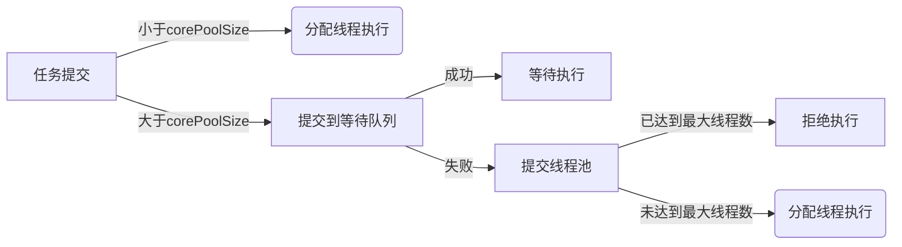

## 概述

Java 的线程池是一种基于池化思想，用于管理和重用线程的机制。使用线程池可以带来一系列好处：

1. **降低资源消耗**：通过池化技术重复利用已创建的线程，降低线程创建和销毁造成的损耗。
2. **提高响应速度**：任务到达时，无需等待线程创建即可立即执行。
3. **提高线程的可管理性**：线程是稀缺资源，如果无限制创建，不仅会消耗系统资源，还会因为线程的不合理分布导致资源调度失衡，降低系统的稳定性。使用线程池可以进行统一的分配、调优和监控。
4. **提供更多更强大的功能**：线程池具备可拓展性，允许开发人员向其中增加更多的功能。比如延时定时线程池ScheduledThreadPoolExecutor，就允许任务延期执行或定期执行。


Java 提供了 Executor 框架作为线程池的实现，其中 ThreadPoolExecutor 是其中最为重要的实现之一。


> 池化思想就是一种将资源统一在一起管理的一种思想，广泛应用在计算机、金融、设备、管理等各个领域。在计算机领域中表现为同意管理 IT 资源，包括服务器、存储、网络资源等等， 例如：
> - 内存池：预先申请内存，提升申请内存速度，减少内存碎片
> - 连接池：预先申请数据库连接，提升申请连接的速度，降低系统的开销
> - 实例池：循环使用对象，减少资源在初始化和释放时的昂贵损耗


## 使用

### 创建线程池

```java
@Test
public void testThreadPoolExecutor() {
    // 1. 创建线程池
    ExecutorService executorService = new ThreadPoolExecutor(6, 10, 
                                        1000, TimeUnit.MILLISECONDS, 
                                        new LinkedBlockingQueue<>(1000), 
                                        Executors.defaultThreadFactory());
    // 2. 提交任务
    for (int i = 0; i < 10; i++) {
        executorService.submit(() -> {
            System.out.println("test02");
        });
    }
    
    // 3. 关闭线程池
    executorService.shutdown();
}

// 线程池构造方法
ThreadPoolExecutor(int corePoolSize,      // 常驻线程数量
                   int maximumPoolSize,   // 允许的最大线程数量
                   long keepAliveTime,    // 当线程数量超过corePoolSize后，多余的空闲线程的存活时间
                   TimeUnit unit,         // keepAliveTime 单位
                   BlockingQueue<Runnable> workQueue, // 任务队列，保存被提交但尚未执行的任务
                   ThreadFactory threadFactory,       // 线程工厂
                   RejectedExecutionHandler handler)  // 任务过多时的拒绝策略
```

当一个`Runnable/Callable`任务通过`submit/execute`提交到线程池后，会按如下的逻辑进行处理：**corePoolSize -> 任务队列 -> maximumPoolSize -> 拒绝策略**。




### 任务队列

存储提交到线程池但尚未执行的 Runnable 任务队列，是一个实现了`BlockingQueue`接口的对象。常用的队列实现有：

- `SynchronousQueue`: 直接提交的队列，没有容量，来一个任务执行一个，没有多余线程则执行拒绝策略
- `ArrayBlockingQueue`: 有界任务队列，构造时需指定容量
- `LinkedBlockingQueue`: 无界任务队列，默认容量`Integer.MAX_VALUE`，任务繁忙时会一直创建线程执行，直至资源耗尽
- `PriorityBlockingQueue`: 带有执行优先级的无界队列

使用自定义线程池时，需要根据应用的具体情况，选择合适的并发队列为任务做缓冲。当线程资源紧张时，不同的并发队列对系统行为和性能的影响均不同。


### 线程工厂

`ThreadFactory`接口的实现类用来创建线程，接口定义了 `Thread newThread(Runnable r)` 用于创建新的线程，默认使用的是`Executors.DefaultThreadFactory`。

```java
// j.u.c.Executors.DefaultThreadFactory
private static class DefaultThreadFactory implements ThreadFactory {
    private static final AtomicInteger poolNumber = new AtomicInteger(1);
    private final ThreadGroup group;
    private final AtomicInteger threadNumber = new AtomicInteger(1);
    private final String namePrefix;

    DefaultThreadFactory() {
        SecurityManager s = System.getSecurityManager();
        group = (s != null) ? s.getThreadGroup() : Thread.currentThread().getThreadGroup();
        namePrefix = "pool-" + poolNumber.getAndIncrement() + "-thread-";
    }

    public Thread newThread(Runnable r) {
        Thread t = new Thread(group, r, namePrefix + threadNumber.getAndIncrement(), 0);
        if (t.isDaemon())   t.setDaemon(false);
        if (t.getPriority() != Thread.NORM_PRIORITY)    t.setPriority(Thread.NORM_PRIORITY);
        return t;
    }
}
```


### 拒绝策略

当线程池中的线程已经达到最大线程数，任务队列也已经填满的情况，将对新来的任务执行某种拒绝策略，所有的策略需要实现`RejectedExecutionHandler`接口。ThreadPoolExecutor 内置了以下四种策略：

- `AbortPolicy`: 默认策略，丢弃并抛出RejectedExecutionException异常
- `CallersRunsPolicy`: 绕过线程池，由主线程直接调用任务的run()方法执行
- `DiscardOldestPolicy`: 抛弃队列中等待最久的任务，然后尝试再次提交当前任务
- `DiscardPolicy`: 丢弃且不抛异常


其它框架也提供了更丰富的实现，例如：
- Dubbo 在抛出 RejectedExecutionException 异常之前会记录日志，并 dump 线程栈信息，方便定位问题
- Netty 会创建一个新线程来执行任务
- ActiveMQ 会设定超时等待，尝试放入队列
- PinPoint 使用拒绝策略链，然后逐一尝试链中每种拒绝策略


### Executors

Executor 框架内置了`Executors`工具类，基于 ThreadPoolExecutor 创建特定的线程池。常用线程池包括：

- `SingleThreadExecutor`: 
  - 只有一个核心线程的线程池，多余任务都放到无界任务队列中排队
- `FixedThreadPool`: 
  - 固定线程数量的线程池，只有核心线程
  - 新任务提交时，若有空闲线程立即执行，否则暂存在一个无界的任务队列中
- `CachedThreadPool`: 
  - 可调整线程数量的线程池，采用 SynchronousQueue 阻塞式任务队列，且只有非核心线程。
  - 新任务提交时，优先使用可复用线程，否则创建新线程处理任务，最多 Integer.MAX_VALUE 个
  - 所有线程完成后返回线程池，空闲线程有存活时间，超时回收


Executor 还提供`Executors.newScheduledThreadPool(n)`，返回一个可以执行延迟/定时任务的线程池 `ScheduledExecutorService`，相比使用单线程的 Timer 定时任务功能更加强大且安全高效。不过如果中途任务出现异常，后续执行会被中断。

```java
// 延迟执行任务
public ScheduledFuture<?> schedule(Runnable command, long delay, TimeUnit unit);

// 循环执行任务，但必须等上一个任务执行完才会开始下一个
public ScheduledFuture<?> scheduleAtFixedRate(Runnable command,
                                              long initialDelay,
                                              long period,
                                              TimeUnit unit);

// 循环执行任务，上一个任务执行完间隔 delay 后开始下一个
public ScheduledFuture<?> scheduleWithFixedDelay(Runnable command,
                                                 long initialDelay,
                                                 long delay,
                                                 TimeUnit unit);
```


不过阿里巴巴开发规约里不建议使用 Executors 创建线程池，更推荐开发者自己定义线程池的各个参数，以更加深入的理解参数的设定，同时：
- FixedThreadPool 和 SingleThreadExecutor 使用的是无界的 LinkedBlockingQueue，任务队列最大长度为 `Integer.MAX_VALUE`,可能堆积大量的请求，从而导致 OOM。
- CachedThreadPool 使用的是同步队列 SynchronousQueue, 允许创建的线程数量为 Integer.MAX_VALUE ，可能会创建大量线程，从而导致 OOM。
- ScheduledThreadPool 和 SingleThreadScheduledExecutor 使用的无界的延迟阻塞队列DelayedWorkQueue，任务队列最大长度为`Integer.MAX_VALUE`，可能堆积大量的请求，从而导致 OOM。


## 类层级结构

- `Executor`顶层接口里只定义了一个`execute(Runable)`执行任务的接口方法

- 子接口 `ExecutorService` 拓展了 Executor，定义了更多提交任务、执行多个任务，并将结果封装成 Future 的方法，以及关闭线程池的接口方法

- `AbstractExecutorService` 则是上层的抽象类，通过模板方式定义了一些方法的默认实现，将执行任务的流程串联起来，使得下层的具体实现只要关注具体执行任务的方法即可
 
- 具体的实现类 `ThreadPoolExecutor` 一方面维护自身的生命周期，另一方面同时管理线程和任务，使两者良好的结合从而执行并行任务


## ctl 变量


`ctl` 变量是一个 AtomicInteger，聚合了线程池的状态和线程数量两个域，可以保证同时对这两个域的修改是原子的，提高了效率并减少了竞态条件的可能性。

`ctl` 的高 3bits 表示线程池的运行状态，运行状态为负，其他状态非负，状态值的大小顺序为：Running < SHUTDOWN < STOP < TIDYING < TERMINATED；`ctl` 的低 29bits 为当前池中的线程数量，因此目前线程池最多支持 $2^{29}-1$，大约 50000 万个线程。

```java
private final AtomicInteger ctl = new AtomicInteger(ctlOf(RUNNING, 0));
// 29  workerCount 位数
private static final int COUNT_BITS = Integer.SIZE - 3;
// 000 11111111111111111111111111111  workerCount 的掩码
private static final int COUNT_MASK = (1 << COUNT_BITS) - 1;

// 高三位表示 runState
// 111 00000000000000000000000000000  
private static final int RUNNING    = -1 << COUNT_BITS;
// 000 00000000000000000000000000000  
private static final int SHUTDOWN   =  0 << COUNT_BITS;
// 001 00000000000000000000000000000  
private static final int STOP       =  1 << COUNT_BITS;
// 010 00000000000000000000000000000  
private static final int TIDYING    =  2 << COUNT_BITS;
// 011 00000000000000000000000000000  
private static final int TERMINATED =  3 << COUNT_BITS;

// 获取当前线程池的运行状态,即取前3位
private static int runStateOf(int c)     { return c & ~COUNT_MASK; }
// 获取工作线程数量,即取后29位
private static int workerCountOf(int c)  { return c & COUNT_MASK; }
// 聚合 runState 和 workerCount
private static int ctlOf(int rs, int wc) { return rs | wc; }
```


线程池的五种状态转换关系：

- **RUNNING**：接受新任务，并处理入队任务
- **SHUTDOWN**：不接受新任务，但处理入队任务
- **STOP**：不接受新任务，不处理入队任务，并中断进行中的任务
- **TIDYING**：所有任务已终止，workCount=0，并且会执行 terminated()
- **TERMINATED**：terminated() 执行完后的状态


## 提交任务

提交任务包括两个方法：

- **submit**：定义在 AbstractExecutorService 中，既可以提交 Runnable，也可以提交 Callable，还可以指定成功的返回值
- **execute**：定义在 ThreadPoolExecutor 中，仅能提交 Runnable

submit 功能更加强大，本质上是将传进来的任务包装成一个 FutureTask 然后交由 execute 执行，而 execute 是真正意义上提交任务到线程池去执行。提交任务返回一个 Future 对象，可以通过它的 get() 方法获取任务执行过程中出现的异常信息。

```java
// java.util.concurrent.AbstractExecutorService#submit
public <T> Future<T> submit(Runnable task, T result) {
    if (task == null) throw new NullPointerException();
    RunnableFuture<T> ftask = newTaskFor(task, result);
    execute(ftask);
    return ftask;
}

// java.util.concurrent.AbstractExecutorService#submit
public <T> Future<T> submit(Callable<T> task) {
    if (task == null) throw new NullPointerException();
    RunnableFuture<T> ftask = newTaskFor(task);
    execute(ftask);
    return ftask;
}

// java.util.concurrent.ThreadPoolExecutor#execute
public void execute(Runnable command) {
    if (command == null)
        throw new NullPointerException();
    int c = ctl.get();
    // 1. worker 数量 < corePoolSize => addWorker 新增核心线程
    if (workerCountOf(c) < corePoolSize) {
        if (addWorker(command, true))
            return;
        c = ctl.get();
    }
    // 2. worker 数量 >= corePoolSize => 提交到任务队列
    if (isRunning(c) && workQueue.offer(command)) {
        int recheck = ctl.get();
        // 重新校验线程池，如果正在停止就移除任务然后执行拒绝
        if (!isRunning(recheck) && remove(command))
            reject(command);
        // worker = 0（例如 corePoolSize = 0），新增非核心线程
        else if (workerCountOf(recheck) == 0)
            addWorker(null, false);
    }
    // 3. 任务队列已满 => 新增非核心线程
    else if (!addWorker(command, false))
        // 4. 失败 => 拒绝策略
        reject(command);
}
```


JDK 还提供了一些用于执行任务集合的方法：

```java
// 提交任务 task，用返回值 Future 获得任务执行结果
<T> Future<T> submit(Callable<T> task);

// 提交 tasks 中所有任务
<T> List<Future<T>> invokeAll(Collection<? extends Callable<T>> tasks)

// 提交 tasks 中所有任务，带超时时间
<T> List<Future<T>> invokeAll(Collection<? extends Callable<T>> tasks, long timeout, TimeUnit unit)

// 提交 tasks 中所有任务，哪个任务先成功执行完毕，返回此任务执行结果，其它任务取消
<T> T invokeAny(Collection<? extends Callable<T>> tasks)

// 提交 tasks 中所有任务，哪个任务先成功执行完毕，返回此任务执行结果，其它任务取消，带超时时间
<T> T invokeAny(Collection<? extends Callable<T>> tasks, long timeout, TimeUnit unit)
```


## addWorker

Worker 继承自 AQS，通过 CLH 队列来实现独占锁，一旦通过 lock 上锁，表示当前线程正在执行任务，不应被中断，否则就是空闲状态没有在处理任务。当线程池执行 shutdown 后，会通过 interruptIdleWorkers 去尝试中断空闲线程，里面会调用实现了 AQS 的 tryLock() 判断当前线程是否空闲来决定是否回收。

```java
private final class Worker extends AbstractQueuedSynchronizer implements Runnable {

    final Thread thread;            // 关联的线程
    Runnable firstTask;             // 第一个任务
    volatile long completedTasks;   // 完成的任务数


    Worker(Runnable firstTask) {
        setState(-1); 
        this.firstTask = firstTask;
        this.thread = getThreadFactory().newThread(this);
    }

    // 定义在 ThreadPoolExecutor 中
    public void run() { runWorker(this); }

    // 基于 AQS 的 lock, tryLock, unlock 等等...
}
```


addWorker 分两个大的步骤：
1. workerCount +1
2. 创建 Worker 实例加入 workers 集合并运行任务

```java
private boolean addWorker(Runnable firstTask, boolean core) {
    // 1. worker 计数 +1
    retry:
    for (int c = ctl.get();;) {
        // 1.1 校验状态
        if (runStateAtLeast(c, SHUTDOWN) 
        && (runStateAtLeast(c, STOP) || firstTask != null || workQueue.isEmpty()))
            return false;

        for (;;) {
            // 1.2 校验线程数
            if (workerCountOf(c) >= ((core ? corePoolSize : maximumPoolSize) & COUNT_MASK))
                return false;
            // 1.3 CAS 线程数 +1 如果成功，就跳出 retry 开始创建 Worker
            if (compareAndIncrementWorkerCount(c))
                break retry;
            // 1.4 状态发生变化重试
            c = ctl.get();
            if (runStateAtLeast(c, SHUTDOWN))
                continue retry;
        }
    }

    // 2. 创建 Worker 加入 workers 集合，并运行任务
    boolean workerStarted = false;
    boolean workerAdded = false;
    Worker w = null;
    try {
        // 2.1 创建 Worker 对象
        w = new Worker(firstTask);
        final Thread t = w.thread;
        if (t != null) {
            // 安全访问 worker 集合
            final ReentrantLock mainLock = this.mainLock;
            mainLock.lock();
            try {
                // 2.2 校验状态
                int c = ctl.get();
                if (isRunning(c) || (runStateLessThan(c, STOP) && firstTask == null)) {
                    if (t.getState() != Thread.State.NEW)
                        throw new IllegalThreadStateException();
                    // 2.3 加入集合
                    workers.add(w);
                    workerAdded = true;
                    int s = workers.size();
                    if (s > largestPoolSize)
                        largestPoolSize = s;
                }
            } finally {
                mainLock.unlock();
            }
            // 2.4 启动线程执行 firstTask
            if (workerAdded) {
                t.start();
                workerStarted = true;
            }
        }
    } finally {
        // 安全清理工作
        if (!workerStarted)
            addWorkerFailed(w);
    }
    return workerStarted;
}
```


## runWorker

创建 Worker 的时候，是把 worker 自己（实现了 Runnable）作为参数传入 Thread 构造器，所以 worker.thread.start() 实际就是运行 Worker::run() -> ThreadPoolExecutor::runWorker 方法。

在 runWorker() 里，worker 不断从任务队列里获取任务，执行任务前置 -> 业务 -> 任务后置。而在获取任务的方法 getTask() 里，worker 根据是否设定超时，通过 poll/take 从任务队列中阻塞式获取任务并返回。从中也可以看出其实线程池内部是不区分核心/非核心线程的，都是通过当前线程池中的 Worker 个数和任务队列的状态来判断是否移除或添加 worker。

```java
// java.util.concurrent.ThreadPoolExecutor#addWorker
final void runWorker(Worker w) {
    Thread wt = Thread.currentThread();
    Runnable task = w.firstTask;
    w.firstTask = null;
    // Worker 构造方法里 setState(-1) 加锁了，这里解锁以允许中断
    w.unlock();
    boolean completedAbruptly = true;
    try {
        // 不断循环从 workQueue 中获取任务
        while (task != null || (task = getTask()) != null) {
            // 一个 worker 同一时间仅执行一个任务
            w.lock();
            // 校验状态（已停止/worker被中断）
            if ((runStateAtLeast(ctl.get(), STOP) || (Thread.interrupted() && runStateAtLeast(ctl.get(), STOP))) && !wt.isInterrupted())
                wt.interrupt();
            
            try {
                // 执行前 hook
                beforeExecute(wt, task);
                try {
                    task.run();
                    // 执行后 hook
                    afterExecute(task, null);
                } catch (Throwable ex) {
                    afterExecute(task, ex);
                    throw ex;
                }
            } finally {
                // 清理和统计工作
                task = null;
                w.completedTasks++;
                w.unlock();
            }
        }
        completedAbruptly = false;
    } finally {
        // 没有任务需要处理，从 workers 集合中移除当前 worker
        // 并判断是否需要添加新 worker
        processWorkerExit(w, completedAbruptly);
    }
}

// java.util.concurrent.ThreadPoolExecutor#getTask
private Runnable getTask() {
    boolean timedOut = false;

    for (;;) {
        int c = ctl.get();

        // 状态校验（进行shutdown并且队列为空，需要退出 worker）
        if (runStateAtLeast(c, SHUTDOWN) && (runStateAtLeast(c, STOP) || workQueue.isEmpty())) {
            decrementWorkerCount();
            return null;
        }

        int wc = workerCountOf(c);
        boolean timed = allowCoreThreadTimeOut || wc > corePoolSize;
        // 线程过多，剔除多余 worker
        if ((wc > maximumPoolSize || (timed && timedOut)) && (wc > 1 || workQueue.isEmpty())) {
            if (compareAndDecrementWorkerCount(c))
                return null;
            continue;
        }

        try {
            // 如果开启定时，使用 poll 限时阻塞，否则使用 take 无限阻塞
            Runnable r = timed ? workQueue.poll(keepAliveTime, TimeUnit.NANOSECONDS) : workQueue.take();
            if (r != null)
                return r;
            timedOut = true;
        } catch (InterruptedException retry) {
            timedOut = false;
        }
    }
}
```


## 关闭

ThreadPoolExecutor 中有两个关闭的方法，它们将改变线程池至不同的运行状态：
- **shutdown() -> SHUTDOWN** 中断空闲线程
- **shutdownNow() -> STOP** 强制中断所有线程

为了保证线程安全，在 ThreadPoolExecutor 中，凡是需要操作 workers 集合的地方都需要锁上 mainLock 这个 ReentrantLock。

```java
public void shutdown() {
    final ReentrantLock mainLock = this.mainLock;
    mainLock.lock();
    try {
        // SecurityManager 检查
        checkShutdownAccess();
        // 提升状态至 SHUTDOWN
        advanceRunState(SHUTDOWN);
        // 中断所有空闲线程
        interruptIdleWorkers();
        // 关闭 hook
        onShutdown();
    } finally {
        mainLock.unlock();
    }
    tryTerminate();
}

public List<Runnable> shutdownNow() {
    List<Runnable> tasks;
    final ReentrantLock mainLock = this.mainLock;
    mainLock.lock();
    try {
        checkShutdownAccess();
        // 提升状态至 STOP
        advanceRunState(STOP);
        // 强行中断所有线程
        interruptWorkers();
        // 返回任务队列里尚未完成的任务
        tasks = drainQueue();
    } finally {
        mainLock.unlock();
    }
    tryTerminate();
    return tasks;
}
```

无论是 shutdown 还是 shutdownNow，最后都会执行 tryTerminate()，进入 TYDING 状态，执行完空的 terminated() 后进入 TERMINATED 终止状态。现在再回过去看[线程池状态转换](#ctl-变量)就清楚多了。

```java
final void tryTerminate() {
    // 
    for (;;) {
        int c = ctl.get();
        if (isRunning(c) || runStateAtLeast(c, TIDYING) || (runStateLessThan(c, STOP) && ! workQueue.isEmpty()))
            return;
        // workerCount > 0 清理一个空闲 worker 后返回
        if (workerCountOf(c) != 0) { // Eligible to terminate
            interruptIdleWorkers(ONLY_ONE);
            return;
        }

        // 走到这里说明 workerCount = 0，可以终止了
        final ReentrantLock mainLock = this.mainLock;
        mainLock.lock();
        try {
            // 设置 TIDYING 状态
            if (ctl.compareAndSet(c, ctlOf(TIDYING, 0))) {
                try {
                    terminated();
                } finally {
                    // 执行完 terminated() 后进入 TERMINATED 状态
                    ctl.set(ctlOf(TERMINATED, 0));
                    termination.signalAll();
                }
                return;
            }
        } finally {
            mainLock.unlock();
        }
        // else retry on failed CAS
    }
}
```


## 整体逻辑框图

来自 https://juejin.cn/post/6926471351452565512 的一幅图，画的太好了，一图了解线程池工作原理。


## 应用


### 线程数量

**CPU 密集型运算**

通常采用 `cpu 核数 + 1` 能够实现最优的 CPU 利用率，+1 是保证当线程由于页缺失故障（操作系统）或其它原因导致暂停时，额外的这个线程就能顶上去，保证 CPU 时钟周期不被浪费。


**IO 密集型运算**

当执行 I/O 操作时、远程 RPC 调用、数据库操作时，CPU 闲下来就可以利用多线程提高它的利用率。《Java Concurrency in Practice》一书给出了估算线程数量的公式：

$$N_{threads} = N_{cpu} \times U_{cpu} \times (1 + \frac{W}{C})$$

其中，
$ N_{cpu} = CPU的数量 $
$ U_{cpu} = 目标CPU的使用率 0-1 之间 $
$ \frac{W}{C} = 等待时间与计算时间的比率 $


但实际中还是需要通过测试得到业务最佳的参数配置，所以动态线程池参数是一个更好的选择。


### 动态线程池参数

小小总结一下 —— [Java线程池实现原理及其在美团业务中的实践](https://tech.meituan.com/2020/04/02/java-pooling-pratice-in-meituan.html) 

实际生产中需要并发性的场景主要有两个：

1. 并行执行子任务，提高响应速度。也就是说任务不应该缓存下来慢慢执行，而应立即执行，所以要尽量使用同步队列。
2. 并行执行大批次任务，提升吞吐量。即应该用队列去缓存大批量的任务，但队列必须有界，防止无限制堆积。

实际中线程池的参数是比较难以设置的，通常需要实际生产环境的验证得到一个较好的参数值，但是面对某些突发的情况又要及时做出调整，如果写死在代码里，修改并重写部署的成本会比较高，因此美团内部采用了动态线程池的方案。

线程池的构造参数有8个，但其中最核心的就三个：corePoolSize、maximumPoolSize、workQueue，基本决定了线程池的任务分配和线程分配策略。ThreadPoolExecutor 正好提供了一系列核心配置的 setter/getter 方法，提供了可以动态修改的可能性。此外，一系列队列任务相关的 API 可以实现线程池的多维度实时监控。

```java
public void setCorePoolSize(int corePoolSize) {
    // 校验
    if (corePoolSize < 0 || maximumPoolSize < corePoolSize)
        throw new IllegalArgumentException();
    // 差值
    int delta = corePoolSize - this.corePoolSize;
    this.corePoolSize = corePoolSize;
    // 如果现有的worker大于corePoolSize，中断空闲的worker
    if (workerCountOf(ctl.get()) > corePoolSize)
        interruptIdleWorkers();
    else if (delta > 0) {
        // 否则尝试增加新的 worker
        int k = Math.min(delta, workQueue.size());
        while (k-- > 0 && addWorker(null, true)) {
            if (workQueue.isEmpty())
                break;
        }
    }
}
public int getCorePoolSize() { return corePoolSize; }

public void setMaximumPoolSize(int maximumPoolSize) { ... }
public int getMaximumPoolSize() { return maximumPoolSize; }

public void setKeepAliveTime(long time, TimeUnit unit) { ... }
public long getKeepAliveTime(TimeUnit unit) { return unit.convert(keepAliveTime, TimeUnit.NANOSECONDS); }

public void setRejectedExecutionHandler(RejectedExecutionHandler handler) { ... }
public RejectedExecutionHandler getRejectedExecutionHandler() { return handler; }

public void setThreadFactory(ThreadFactory threadFactory) { ... }
public ThreadFactory getThreadFactory() { return threadFactory; }

public BlockingQueue<Runnable> getQueue() { return workQueue; }
......
```


## 参考

1. https://juejin.cn/post/6926471351452565512
2. https://www.cnblogs.com/yougewe/p/12267274.html
3. https://www.cnblogs.com/chdf/p/11572889.html
4. [Java线程池实现原理及其在美团业务中的实践](https://tech.meituan.com/2020/04/02/java-pooling-pratice-in-meituan.html)
