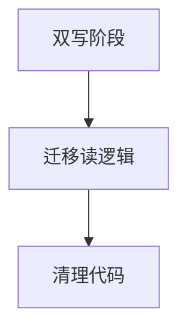
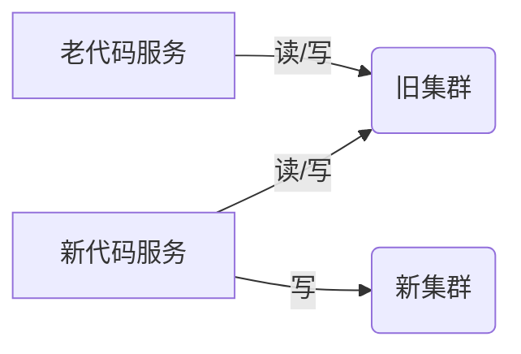
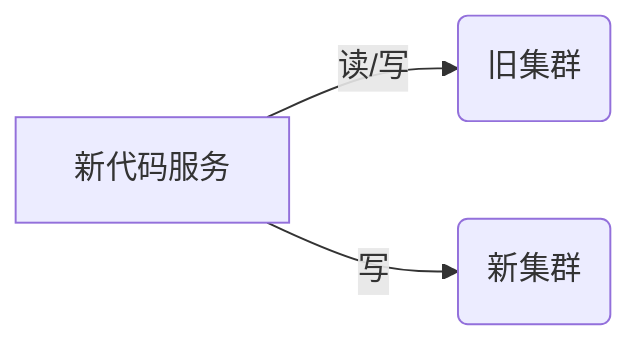
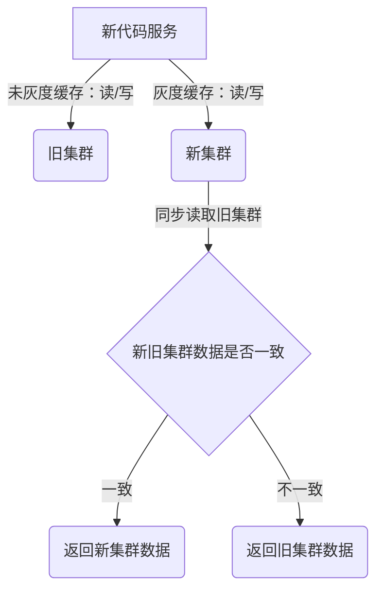
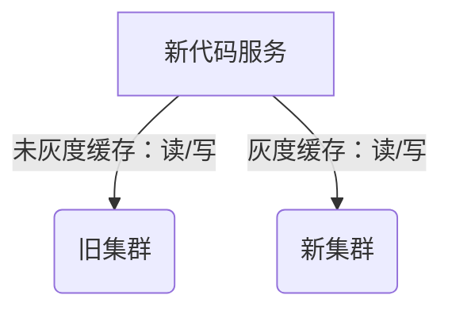
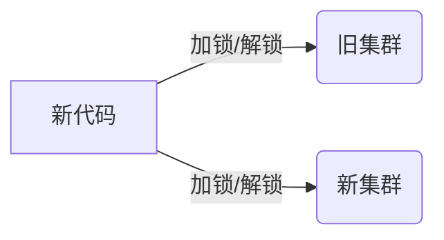
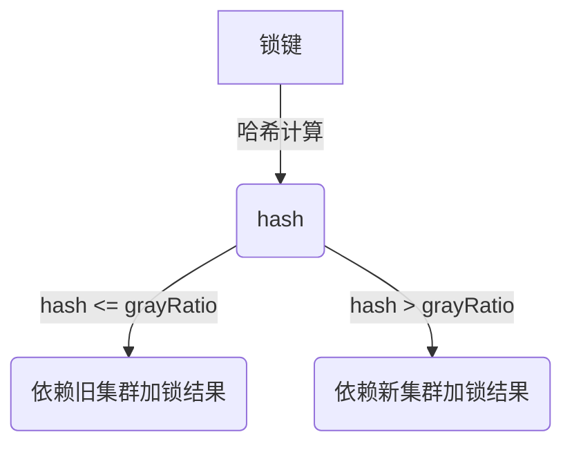

## 背景

由于组织架构等历史原因，所在业务的一个核心服务和另一业务线的多个服务是共用了一个 Redis 集群，前段时间该集群发生了连接数过高等问题，为了避免其它业务的服务干扰 Redis 集群进而影响我们自己业务，需要将该服务所使用的 Redis 集群迁移到我们业务自己的集群。

## 总体规划

该服务中使用了大约 20个类别的 Redis 缓存，其中最核心的缓存还使用了 Tair 作为缓存备份，以及一些基于 Redis 的分布式锁（单独讨论）。由于是技术需求，没有过多的资源投入，而且是业务核心中的核心服务，一旦缓存迁移出现失败，或者数据不一致的问题，就会对业务产生很大的影响，因此迁移难度较大。

首先需要梳理出所有的缓存类型，包括各自的使用场景、key、value 类型、过期时间、API 使用情况等等，评估出各个缓存的重要性，从低风险的缓存开始迁移，逐步扩大迁移范围，迁移过程中要设置观察指标，且必须有可回滚的手段。总体阶段如下，分为三个阶段：双写、迁读、清理代码

## 双写阶段

这一阶段，主要是清理服务中的老旧无效代码，并接入新的 Redis 集群，所有对老集群的写操作，同步写到新集群，并维持从老集群读不变。此外，基于中间件的能力，打点判断两个集群的写操作次数是否一致，并观察写操作的性能，判断对业务性能的影响程度。

这一阶段持续了一个多月，主要是保证上线前存在的老缓存都自然失效，后续的新缓存在两个集群中的数据、过期时间等都保持一致。这里需要根据实际的缓存使用场景判断双写阶段的持续时间。

**现状：**

**一期上线过程中：**

**一期上线完成后：**

## 迁移读逻辑

二期的代码可以在一期的时候一并上线，通过远程配置的形式控制某类缓存是否要从新集群读取。为了降低迁移风险，读缓存的时候还要加入双读判等，观察新老集群读取的数据是否一致，如果不一致，仍然以老集群的数据为准，并打日志记录key 和 value 差异。然后需要研究不一致的原因，比如手动查询 Redis 集群，判断是真的数据发生不一致了，还是并发的时候产生的暂时性不一致。前者需要结合实际业务场景进一步调研，例如有可能是 Redis 集群本身接口存在失败的情况，后者可以忽略。

如果确实存在数据不一致的场景，并且判断是并发导致的暂时性不一致，或者非服务自身原因导致的不一致，且判断对业务没有实质性影响的，可以再上一版代码，通过远程配置逐步将所有缓存的读操作迁移到新集群。这一阶段也可以持续一段时间，等业务经过一段时间验证新集群的读取没有问题，就可以进入下一阶段了。

## 清理代码

这一阶段，主要是将代码中的读写旧集群逻辑全部下线（此时应该没有读取旧集群的调用操作了）。

## 分布式锁

不同于业务数据的缓存，分布式锁的迁移更加困难，因为不能简单得通过灰度开关去迁移一个锁的加锁解锁逻辑，一旦由于并发场景下对新老集群的加解锁逻辑不同步，就很有可能引发业务异常。因此分布式锁的迁移可以单独做，和业务数据的迁移分离开，降低风险。

此次分布式锁的迁移正好尝试了借助 DeepSeek-R1 来设计方案，整体看下来，好用是好用的，能给出我现在没能想到的设计，但实践还是得靠人去做，所以风险得自己担！下面是通过与 DeepSeek 对话整理出来的方案。

### 双写加锁

首先第一阶段，类似的也是要双写集群，同步对新旧集群加锁、解锁，但此时业务上仍要依赖旧集群，即只要旧集群加锁成功，相当于线程拿到了锁，可以执行临界区的业务代码。而新集群的锁相当于是一个影子锁，只是复制旧锁操作，并且在操作失败的时候要打点统计，以便对业务并发竞争的程度有个认知。

另外，DeepSeek 提出了最好使用带版本号的锁键，即新集群的所有锁键前缀加个“V2”来和旧集群的锁键区分开，并且能在异常情况下实现回滚操作。

### 迁移

这是最关键的一个阶段，如何借助远程配置，来保证多个线程能够同时切换依赖，到新集群去加解锁。这里 DeepSeek 给的方案，是根据锁键来进行灰度，例如系统中的一个分布式锁场景的 key 是用户的订单号，那么可以先对订单号进行哈希计算，并基于远程配置的灰度比例决定依赖旧集群还是新集群，这样就可以保证同一个锁对象的请求在同一时刻仅依赖旧集群或者新集群其中一个。

但仔细想想这里其实仍然会存在问题，考虑一个极端的并发场景，远程的配置中心在下发“灰度比例”这个配置项时，分布式部署的各个机器其实是会有时延的，如果在切换的这短暂时间里，有若干正巧在灰度边界上的订单号并发请求打进来，那么两个请求可能分别依赖新旧集群的加锁结果，导致锁失效，从而产生并发问题。

当然上面讨论的只是一个非常极端的场景，实际业务上不太可能出现，真要出现了自认倒霉，手动修数据吧😥不过我也尝试把这种情况提给了 DeepSeek 了，然后它给了我如下的答复，也许这些措施是有效的（反熵机制是个啥？？？），但是复杂度太高，铁定是不能做到我们的业务系统里的。

后续只要把旧集群的老代码下掉即可，不过呢，分布式锁的迁移实在是麻烦，而且风险有点大，暂时还没有实际动手去迁，后面再说吧。（从技术角度想是可以迁的，从业务角度想还是放那吧，也没啥影响）

